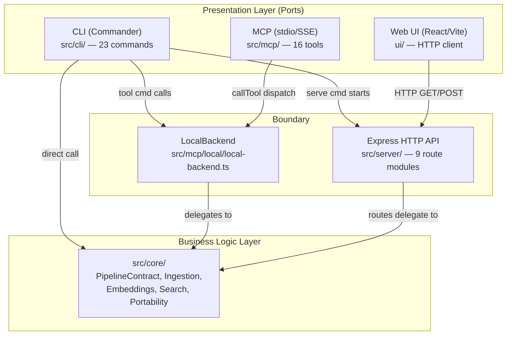

# Presentation Layer

**Path:** `src/cli/`, `src/mcp/`, `src/server/`, `ui/`
**Philosophy:** Thin ports that delegate all business logic to `src/core/`. No pipeline code, no direct database access, no analysis logic.

---

## 1. Overview

The Presentation Layer contains three equal adapters — **CLI**, **MCP**, and **Web UI**. They are "ports" into the system, not owners of business logic. All three communicate with the Business Logic Layer through well-defined boundaries:



---

## 2. CLI Layer (`src/cli/`)

**Location:** `src/cli/` — 23 files
**Framework:** Commander (`^14.0.3`)

The CLI entry point at `src/cli/index.ts:6-13` creates a `Command` program and registers commands via lazy imports (`createLazyAction`). Each command file is a thin wrapper that validates CLI arguments, calls into `src/core/` functions, and formats output.

### Commands

| Command | File | Lines | What it does | Delegates To |
|---------|------|-------|-------------|--------------|
| `analyze` | `src/cli/index.ts:20-86` | ~66 | Index a repository | `src/core/run-analyze.ts::runFullAnalysis` |
| `serve` | `src/cli/serve.ts` | 59 | Start HTTP API server | `src/server/api.ts::createServer` |
| `mcp` | `src/cli/mcp.ts` | 85 | Start MCP stdio server | `src/mcp/server.ts::startMCPServer` |
| `wiki` | `src/cli/wiki.ts` | — | Generate wiki from KG | `src/core/wiki/` |
| `tool` | `src/cli/tool.ts` | — | Run MCP tool directly | `src/mcp/local/local-backend.ts` |
| `group` | `src/cli/group.ts` | — | Manage repo groups | `src/core/group/` |
| `setup` | `src/cli/setup.ts` | — | Configure MCP for editors | `src/core/setup/` |
| `doctor` | `src/cli/doctor.ts` | — | Diagnose setup issues | `src/core/platform.ts` |
| `status` | `src/cli/status.ts` | — | Show index status | `src/storage/repo-manager.ts` |
| `list` | `src/cli/list.ts` | — | List indexed repos | `src/storage/repo-manager.ts` |
| `clean` | `src/cli/clean.ts` | — | Remove repo index | `src/storage/repo-manager.ts` |
| `remove` | `src/cli/remove.ts` | — | Unregister repo | `~/.gitnexus/registry.json` |
| `publish` | `src/cli/publish.ts` | — | Publish index data | `src/core/publish/` |
| `config` | `src/cli/config.ts` | — | Manage config | `src/config/` |
| `ai-context` | `src/cli/ai-context.ts` | — | Generate AI context files | `src/core/analyze/finalizer.ts` |
| `augment` | `src/cli/augment.ts` | — | Run code augmentation | `src/core/augment/` |
| `eval-server` | `src/cli/eval-server.ts` | — | Start eval server | `src/core/eval/` |
| `skill-gen` | `src/cli/skill-gen.ts` | — | Generate skill files | `src/core/ingestion/` |
| `lazy-action` | `src/cli/lazy-action.ts` | — | Lazy import helper | — |
| `optional-grammars` | `src/cli/optional-grammars.ts` | — | Install optional grammars | `vendor/` |
| `cli-message` | `src/cli/cli-message.ts` | — | Common CLI messages | — |
| `index-repo` | `src/cli/index-repo.ts` | — | Multi-repo indexing | `src/core/run-analyze.ts` |

### Design Constraint: Zero Pipeline Logic

The CLI must **never** contain:
- Pipeline DAG construction (belongs in `run-analyze.ts`)
- Direct LadybugDB queries (belongs in `src/core/lbug/`)
- Embedding model loading (belongs in `src/core/embeddings/`)
- Tree-sitter parsing (belongs in `src/core/ingestion/`)

Verification: `src/cli/analyze.ts` imports and calls `runFullAnalysis` from `src/core/run-analyze.ts` — no pipeline code. `src/cli/serve.ts` imports and calls `createServer` — no database code.

---

## 3. MCP Layer (`src/mcp/`)

**Location:** `src/mcp/` — 7 files
**Framework:** `@modelcontextprotocol/sdk` (`^1.0.0`)
**Transport:** stdio (with stdout sentinel to redirect stray log writes to stderr)

### Architecture

```
mcp/server.ts                    — Transport-agnostic Server creation
  ├── createMCPServer(backend)    — Registers tool/resource/prompt handlers
  └── startMCPServer(backend)     — Attaches stdio transport, graceful shutdown

mcp/tools.ts                     — 11 tool definitions (GITNEXUS_TOOLS)
mcp/resources.ts                 — Resource URIs + templates
mcp/local/local-backend.ts       — Tool dispatch (callTool → Business Logic)
mcp/stdio-context.ts             — Global stdout sentinel
mcp/stdio-capture.ts             — Stdout capture implementation
mcp/staleness.ts                 — Index staleness checks
mcp/compatible-stdio-transport.ts — Stdio transport with safe stdout Proxy
```

### Tools (defined in `src/mcp/tools.ts:54-550`)

| Tool | Category | When to Use |
|------|----------|-------------|
| `list_repos` | Discovery | List all indexed repos |
| `query` | Search | Concept search, execution flows (BM25 + vector) |
| `cypher` | Query | Complex structural graph queries |
| `context` | Navigation | 360-degree view of a symbol (refs, process participation) |
| `impact` | Analysis | Blast radius for code changes |
| `detect_changes` | Analysis | Pre-commit change analysis |
| `rename` | Refactoring | Multi-file coordinated rename |
| `route_map` | API | Route → handler → consumer map |
| `tool_map` | API | MCP tool definitions |
| `shape_check` | API | Response shape vs consumer access |
| `api_impact` | API | Pre-change API route impact |
| `group_list` | Group | Discover repo groups |
| `group_sync` | Group | Rebuild Contract Registry |

### Dispatch Flow

```
MCP Client (Claude Desktop, Cursor, Codex)
  │  stdio JSON-RPC
  ▼
mcp/server.ts :: CallToolRequestSchema handler
  │  getNextStepHint() — appends workflow guidance
  ▼
mcp/local/local-backend.ts :: callTool(name, args)
  │  Dispatches to: impact/query/context/groups/tools
  ▼
src/core/lbug/lbug-adapter/ · src/core/search/ · src/core/group/
  │  Business Logic Layer
  ▼
@ladybugdb/core — embedded graph DB
```

### stdout Safety

The MCP stdio protocol requires that **only JSON-RPC messages** go to stdout. Any stray log output would corrupt the protocol. The `stdio-context.ts` sentinel (installed by `installGlobalStdoutSentinel()`) intercepts all writes to `process.stdout` and redirects non-MCP writes to stderr. All MCP transport writes are tagged and pass through. See `src/cli/mcp.ts:12-27` for the ESM evaluation-order design that ensures the sentinel is installed before any heavy module loads.

---

## 4. Express HTTP Server (`src/server/`)

**Location:** `src/server/` — 11 files + `routes/` — 9 route modules
**Framework:** Express (`^4.19.2`)
**Default:** Port 4747, localhost (`src/cli/serve.ts:28`)

The server is not a standalone layer — it is an **adapter** started by the CLI (`gitnexus serve`) that exposes Business Logic via REST endpoints consumed by the Web UI and `curl` users.

### Route Modules (`src/server/routes/`)

| Module | Endpoints | Delegates To |
|--------|-----------|-------------|
| `repos.ts` | `GET /api/repos`, `GET /api/repo` | `src/storage/repo-manager.ts` |
| `graph.ts` | `GET /api/graph` | `src/core/lbug/lbug-adapter/` |
| `query.ts` | `POST /api/query` | `src/core/lbug/lbug-adapter/` |
| `search.ts` | `GET /api/search` | `src/core/search/hybrid-search.ts` |
| `processes.ts` | `GET /api/processes` | `src/core/lbug/lbug-adapter/` |
| `file.ts` | `GET /api/file` | File system |
| `analyze.ts` | `POST /api/analyze` | `src/core/run-analyze.ts` |
| `embedding.ts` | `POST /api/embed` | `src/core/embeddings/` |
| `health.ts` | `GET /api/health` | Static |
| `index.ts` | Mounts all routes | — |

### Cross-Layer Dependency Weight (from `18-cross-layer-deps.mmd`)

- Server → LadybugDB: **heaviest** — 9 routes import lbug-adapter
- Server → Logger: heavy — 4 files
- Server → Storage: heavy — analyze + repos routes

---

## 5. Web UI (`ui/`)

**Location:** `ui/` — React/Vite SPA
**Framework:** React `^19.2.5`, Vite `^8.0.10`, Tailwind CSS `^4.2.4`
**Communication:** Pure HTTP client via `ui/src/services/backend-client.ts` (895 lines)

### Allowed Dependencies

The UI should only depend on:

| Category | Packages | Purpose |
|----------|----------|---------|
| Framework | `react`, `react-dom` | UI rendering |
| Graph viz | `sigma`, `@sigma/edge-curve`, `d3` | Graph visualization |
| Diagrams | `mermaid` | Architecture diagrams |
| Layout | `graphology-layout-force`, `-forceatlas2`, `-noverlap` | Graph layout calc |
| Icons | `lucide-react` | UI icons |
| CSS | `tailwindcss`, `@tailwindcss/vite` | Styling |
| Build | `vite`, `@vitejs/plugin-react` | Build tooling |
| HTTP | `axios` | Backend API calls |
| Markdown | `react-markdown`, `remark-gfm` | Rich text |

### CURRENT VIOLATIONS: Business Logic Leaked into UI

The following files in `ui/src/` contain business logic that belongs in `src/core/`:

#### File 1: `ui/src/core/llm/agent.ts` (574 lines) — Graph RAG Agent

This is a **LangChain-based Graph RAG agent** containing:
- `createGraphRAGAgent()` — factory function creating a `createReactAgent` with tool definitions
- `streamAgentResponse()` — async generator for streaming LLM responses
- 7 tool implementations: `search`, `cypher`, `grep`, `read`, `overview`, `explore`, `impact`
- Multi-provider LLM client creation: Azure OpenAI, Google Gemini, Anthropic, Ollama, OpenRouter

**Target:** Move to `src/core/llm/agent.ts` in the Business Logic Layer. The agent's tools already communicate via HTTP backend calls — they are server-agnostic logic, not presentation code.

**Evidence:** `ui/src/core/llm/agent.ts:8-15` imports `@langchain/langgraph/prebuilt`, `@langchain/core/messages`, `@langchain/openai`, `@langchain/google-genai`, `@langchain/anthropic`, `@langchain/ollama`. These imports belong in the Business Logic Layer alongside pipeline contracts.

Supporting files in the leaked LLM module:
- `ui/src/core/llm/tools.ts` — tool implementations (imports `backend-client.ts` for HTTP calls)
- `ui/src/core/llm/types.ts` — provider config types
- `ui/src/core/llm/context-builder.ts` — dynamic system prompt builder
- `ui/src/core/llm/settings-service.ts` — provider settings
- `ui/src/core/llm/index.ts` — barrel exports

#### File 2: `ui/src/core/ingestion/cluster-enricher.ts` (243 lines) — LLM Cluster Enricher

This is an **LLM-based cluster enrichment** utility that generates semantic names, keywords, and descriptions for Leiden communities.

**Target:** Move to `src/core/post-pipeline/cluster-enricher.ts` as a Post-Pipeline Processor.

**Evidence:** The file name and location (`ui/src/core/ingestion/`) are misleading — it does NOT parse code or build graphs. It performs LLM-based semantic annotation, which is a business logic concern.

#### File 3: `ui/src/core/graph/` — Graph Data Structures (2 files)

- `ui/src/core/graph/graph.ts` — Client-side graph data structures
- `ui/src/core/graph/types.ts` — Re-exports from `gitnexus-shared`

These are **partially valid** — they provide client-side data structures for Sigma.js visualization. However, the `graphology-layout-*` calculations (force-directed layout) should be Post-Pipeline Processors, not done in the browser on every page load.

### What the UI Does Correctly

- `ui/src/services/backend-client.ts:1-895` — Pure HTTP client. All methods call `fetch()` to `http://localhost:4747/api/...`. Zero pipeline code, zero direct DB access.
- Imports from `gitnexus-shared` are **type-only or utility** (verified across 16 import sites): `GraphNode`, `GraphRelationship`, `NodeLabel`, `PipelineProgress`, `PipelinePhase`, `NODE_TABLES`, `REL_TYPES`, `getSyntaxLanguageFromFilename`, `resilientFetch`.
- Analysis is triggered via `POST /api/analyze` (backend-client.ts:761-778), progress streamed via SSE at `/api/analyze/{jobId}/progress` (backend-client.ts:799-813).

---

## 6. Layer Boundary Summary

| Boundary | From | To | Mechanism | File Reference |
|----------|------|----|-----------|---------------|
| CLI → Core | `src/cli/analyze.ts` | `src/core/run-analyze.ts` | Direct import + function call | `src/cli/index.ts:20-86` |
| CLI → Server | `src/cli/serve.ts` | `src/server/api.ts` | `createServer()` | `src/cli/serve.ts:27` |
| CLI → MCP | `src/cli/mcp.ts` | `src/mcp/server.ts` | `startMCPServer()` | `src/cli/mcp.ts` |
| MCP → Core | `src/mcp/local/local-backend.ts` | `src/core/lbug/`, etc. | `callTool` dispatch | `src/mcp/local/local-backend.ts` |
| Server → Core | `src/server/routes/*.ts` | `src/core/lbug/`, etc. | Route handler imports | `src/server/routes/` (10 modules) |
| Web UI → Server | `ui/src/services/backend-client.ts` | `src/server/routes/` | HTTP fetch | `backend-client.ts:1-895` |
