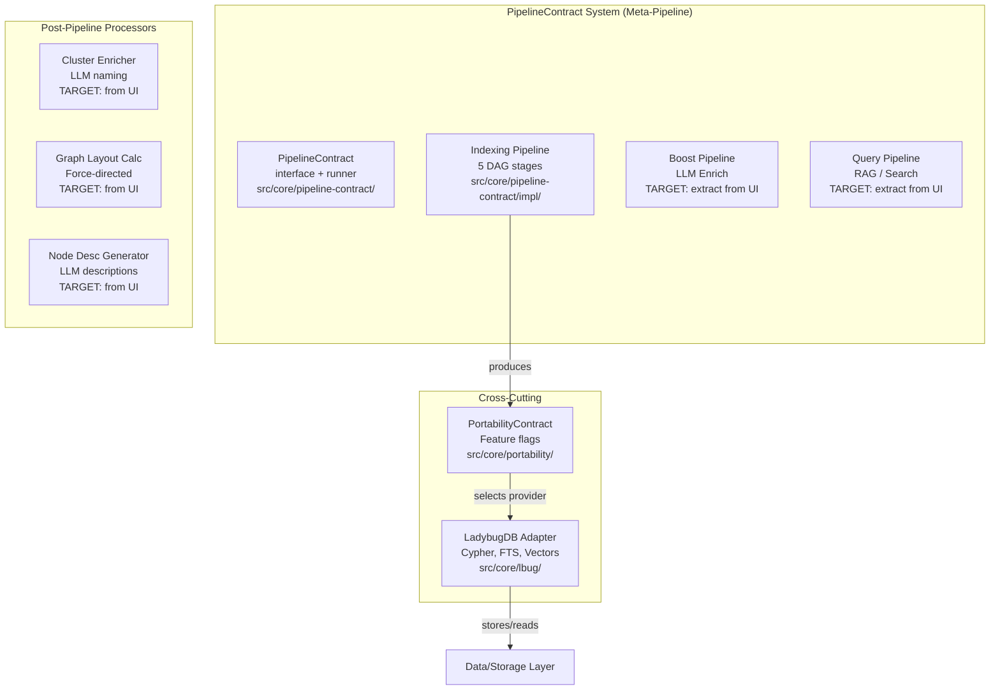
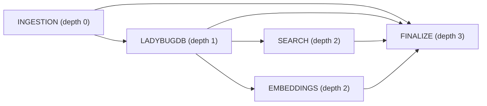
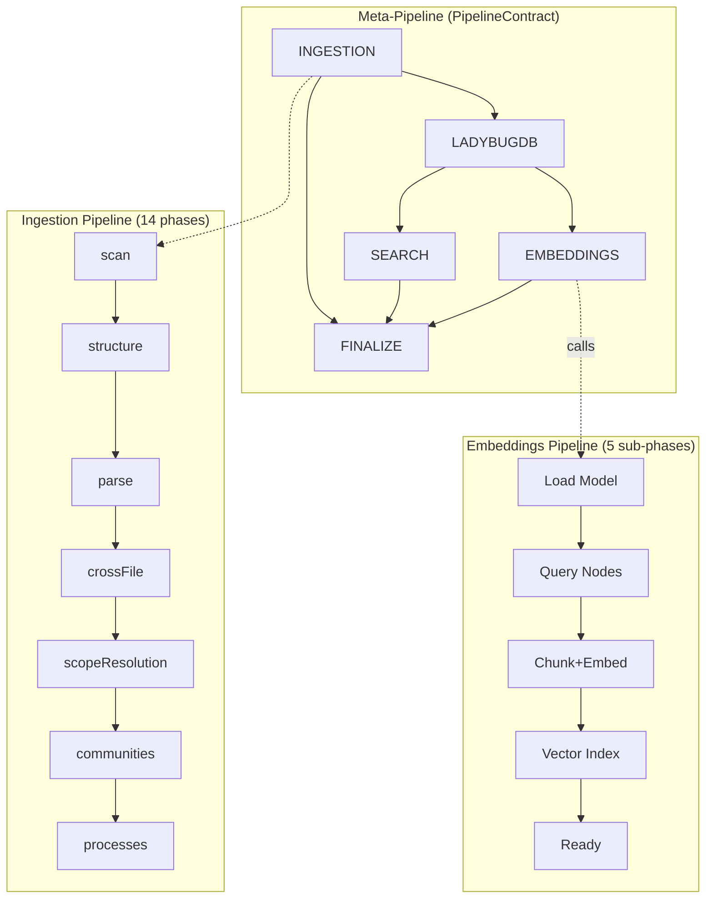

# Business Logic Layer

**Location:** `src/core/` (~400+ files)
**Philosophy:** All domain logic lives here. Independent of presentation (CLI, MCP, HTTP, Web UI). Communicates with Data/Storage Layer through adapters.

---

## 1. Overview

The Business Logic Layer contains three major subsystems:

---

## 2. PipelineContract System (Meta-Pipeline)

**Location:** `src/core/pipeline-contract/` — 6 files
**Concept:** A DAG-based pipeline orchestrator that schedules stages respecting dependency order, checks resource availability, computes artifact fingerprints for freshness, and supports cross-stage cache invalidation.

### 2.1 Core Interfaces (`src/core/pipeline-contract/types.ts:1-83`)

| Interface | Lines | Purpose |
|-----------|-------|---------|
| `PipelineContract<TOutput>` | 55-64 | Contract a stage must implement: `id`, `deps`, `artifact`, `resources`, `onBeforeInvalidation`, `onRestore`, `run(ctx)` |
| `PipelineContext` | 35-46 | Shared context passed to all stages: `repoPath`, `storagePath`, `lbugPath`, `options`, `callbacks`, `results` |
| `PipelineRunner` | 80-82 | DAG execution engine: `resolveOrder()` + `runPipelines()` |
| `PipelineRunOptions` | 66-71 | Control flags: `force`, `only`, `skip`, `failFast` |
| `PipelineRunReport` | 73-78 | Execution results: `results`, `skipped`, `failed`, `fresh` |
| `ArtifactRecord` / `ArtifactFingerprint` | 9-19 | Fingerprint-based freshness tracking |
| `ResourceDeclaration` | 21-27 | Per-stage resource requirement with criticality |
| `CachePayload` | 33 | Cross-stage cache data (e.g., embedding vectors survive DB rebuild) |

### 2.2 PipelineRunner (`src/core/pipeline-contract/runner.ts:1-194`)

The runner at `runner.ts:89-193` (`createPipelineRunner()`) implements:

1. **Topological sort via DFS** (`runner.ts:4-52` `resolvePipelines()`): Assigns depth to each stage via DFS with cycle detection. Stages at same depth run in registration order (no parallelism currently, but depth grouping enables it).

2. **Resource validation** (`runner.ts:121-131`): Before executing a stage, checks all declared resources. Fatal unavailability aborts (if `failFast` is set) or marks stage as FAILED.

3. **Artifact freshness** (`runner.ts:133-142`): Loads stored fingerprint from `meta.json#artifacts`, computes current fingerprint via `contract.artifact.compute(ctx)`, skips execution if match.

4. **onBeforeInvalidation / onRestore hooks** (`runner.ts:150-153`): Notifies downstream stages before an upstream stage runs. Used by `embedding-stage.ts` to cache existing embeddings before LadybugDB rebuild.

5. **Cross-stage cache** (`_stageCache` pattern in `embedding-stage.ts`): The only data flow that bypasses `PipelineContext.results`. Cache survives LadybugDB destruction in memory, restored by SEARCH stage, consumed by EMBEDDINGS stage.

### 2.3 Stage IDs and DAG Dependencies (`src/core/pipeline-contract/descriptors.ts:4-18`)

Stage IDs (`descriptors.ts:4-10`):
- `ingestion` — no deps
- `ladybugdb` — dep: `ingestion`
- `search` — dep: `ladybugdb`
- `embeddings` — dep: `ladybugdb`
- `finalize` — dep: `ingestion`, `ladybugdb`, `search`, `embeddings`

### 2.4 Resource Declarations (`src/core/pipeline-contract/descriptors.ts:27-49`)

| Stage | Fatal Resources | Degrade Resources |
|-------|----------------|-------------------|
| INGESTION | `wasm-runtime` (web-tree-sitter), `source-files` | `grammars` (language parsers) |
| LADYBUGDB | `ladybugdb-core`, `disk-space` | — |
| SEARCH | `ladybugdb-core` | — |
| EMBEDDINGS | `embedding-model` (ONNX, ~690MB), `onnx-runtime`, `memory` (~1GB) | `model-cap` (50K node cap) |
| FINALIZE | `filesystem` (write access) | — |

### 2.5 Shared Stage Types (`src/core/pipeline-contract/stages.ts:1-47`)

| Type | Used By | Purpose |
|------|---------|---------|
| `IngestionOutput` | INGESTION stage | `{ graph, repoPath }` |
| `LadybugStats` | LADYBUGDB stage | `{ nodes, edges, communities, processes }` |
| `EmbeddingConfig` | EMBEDDINGS stage | `{ modelId, dimensions, modelDir, backend, ... }` |
| `EmbeddingResult` | EMBEDDINGS stage | `{ semanticMode, embeddingsCount }` |
| `EmbeddingCache` | Cross-stage cache | `{ embeddings, nodeIds }` |
| `AnalysisMetadata` | FINALIZE stage | Combined pipeline output |
| `EmbeddingMode` | Decision support | `{ shouldGenerateEmbeddings, shouldPreserveCache }` |
| `Device` | Aspirational | `'wasm' \| 'cpu' \| 'cuda' \| 'dml' \| 'remote'` — only `wasm`/`cpu` used |

### 2.6 Concretes (`src/core/pipeline-contract/impl/`)

#### Stage 1: Ingestion — `impl/ingestion-stage.ts`
- **Concrete:** `runPipelineFromRepo` from `src/core/ingestion/pipeline.ts`
- **Dependencies:** `tree-sitter` ^0.21.1 (native C) + `web-tree-sitter` ^0.26.8 (WASM) + 12 language parsers + 5 optional/vendored grammars
- **CPU-only:** Yes — tree-sitter parsing is CPU-bound. Worker pool for parallel file processing.
- **Swappable?** No — directly imports `runPipelineFromRepo`. Would need `ParserProvider` interface.
- **Platform lock:** Native tree-sitter requires `python3`, `make`, `g++` (node-gyp). WASM fallback via `web-tree-sitter` is platform-agnostic.

#### Stage 2: LadybugDB — `impl/lbug-stage.ts`
- **Concrete:** LadybugDB via `@ladybugdb/core` ^0.16.1. Graph loaded via CSV spool + COPY.
- **Dependencies:** `@ladybugdb/core` (pure JS, ~210KB)
- **CPU-only:** Yes — I/O bound (CSV spool + DB writes)
- **Swappable?** No — direct imports of LadybugDB adapter functions. Needs `GraphDatabase` interface.

#### Stage 3: Search — `impl/search-stage.ts`
- **Concrete:** `createSearchFTSIndexes` + `restoreCachedEmbeddings`
- **Dependencies:** `@ladybugdb/core` (reuses DB from Stage 2)
- **CPU-only:** Yes — FTS index creation is database-internal
- **Swappable?** Tied to LadybugDB FTS capabilities

#### Stage 4: Embeddings — `impl/embedding-stage.ts`
- **Concrete:** ONNX Runtime CPU inference via `onnxruntime-node` ^1.24.0 with `e5-small` model (~690MB)
- **Dependencies:** `@huggingface/transformers` ^4.1.0 (model loading), `onnxruntime-node` ^1.24.0 (inference)
- **CPU-only:** Yes — ONNX Runtime CPU (AVX). `Device` type includes `'cuda'`/`'dml'` but unused.
- **Swappable?** Partially — `EmbeddingProvider` interface exists at `src/core/embeddings/provider.ts` with `embedBatch()` and `dimensions()`. Two impls: `NativeNodeProvider` (ONNX CPU) + HTTP client (portable build).

#### Stage 5: Finalize — `impl/finalize-stage.ts`
- **Concrete:** `buildMeta`, `saveMeta`, `registerRepo`, `generateAIContextFiles`
- **Dependencies:** Node.js `fs` module, `src/storage/repo-manager.ts`
- **CPU-only:** I/O bound
- **Swappable?** Yes — stateless, trivial

---

## 3. Three Sub-Pipeline Systems

The Meta-Pipeline (`PipelineContract`) orchestrates three lower-level pipeline systems:

| Pipeline System | Abstraction Level | Phases | Runner | Location | Algorithm |
|----------------|-------------------|--------|--------|----------|-----------|
| **PipelineContract** (Meta) | 5 high-level stages | INGESTION → LADYBUGDB → SEARCH → EMBEDDINGS → FINALIZE | `runner.ts` | `src/core/pipeline-contract/` | DFS topological sort |
| **Ingestion** (low-level) | 14 phases | scan → structure → parse → crossFile → scopeResolution → communities → processes | Kahn's algorithm | `src/core/ingestion/pipeline-phases/runner.ts` | Queue-based topological sort |
| **Embeddings** (low-level) | 5 sub-phases | Load model → Query nodes → Chunk+embed → Vector index → Ready | Sequential | `src/core/embeddings/embedding-pipeline.ts` | Sequential |

Both lower-level systems (Ingestion and Embeddings) are **concretes** serving the corresponding PipelineContract stages. They are not independently schedulable — they are invoked by `ingestion-stage.ts` and `embedding-stage.ts` respectively.

---

## 4. Post-Pipeline Processors (Target)

These components exist in `ui/src/` today and must be extracted into the Business Logic Layer as post-pipeline processors:

### 4.1 Cluster Enricher
- **Current location:** `ui/src/core/ingestion/cluster-enricher.ts` (243 lines)
- **Purpose:** LLM-based semantic naming of Leiden communities. Generates `name`, `keywords`, `description` for each community cluster.
- **Target location:** `src/core/post-pipeline/cluster-enricher.ts`
- **Interfaces to define:**
  - `ClusterEnrichment` — `{ name: string; keywords: string[]; description: string }`
  - `EnrichmentResult` — `{ enrichments: Map<string, ClusterEnrichment>; tokensUsed: number }`
  - `CommunityNode` — `{ id, label, heuristicLabel, cohesion, symbolCount }`

### 4.2 Graph Layout Calculator
- **Current location:** Inlined in UI via `graphology-layout-forceatlas2` and friends
- **Purpose:** Compute force-directed positions for graph nodes
- **Target location:** `src/core/post-pipeline/graph-layout.ts`
- **Rationale:** Layout is a deterministic computation that should be cached server-side, not recalculated in the browser on every page load.

### 4.3 Node Description Generator
- **Current location:** Inlined in UI logic
- **Purpose:** LLM-based description generation for code nodes
- **Target location:** `src/core/post-pipeline/node-desc-generator.ts`

---

## 5. Graph RAG Agent (Target)

### Current location (violation): `ui/src/core/llm/agent.ts` (574 lines)

The LangChain-based Graph RAG agent must be moved to the Business Logic Layer. Supporting files to move:

| File | Lines | Purpose |
|------|-------|---------|
| `ui/src/core/llm/agent.ts` | 574 | Agent factory + streaming response |
| `ui/src/core/llm/tools.ts` | — | 7 tool implementations (search, cypher, grep, read, overview, explore, impact) |
| `ui/src/core/llm/types.ts` | — | Provider config types |
| `ui/src/core/llm/context-builder.ts` | — | Dynamic system prompt builder |
| `ui/src/core/llm/settings-service.ts` | — | Provider settings management |
| `ui/src/core/llm/index.ts` | — | Barrel exports |

**Target location:** `src/core/llm/agent.ts`

**Design integration:** The agent's tools currently communicate via HTTP backend calls (`ui/src/services/backend-client.ts`). In the Business Logic Layer, these tools should call LadybugDB and search adapters directly, eliminating the HTTP round-trip.

---

## 6. PortabilityContract (`src/core/portability/contract.ts:1-70`)

Feature flags that determine platform capabilities at bootstrap:

| Flag | DevContract | PortableContract | Purpose |
|------|-------------|------------------|---------|
| `isPortable` | `false` | `true` | Distinguishes dev vs portable build |
| `hasNativeAddons` | `true` | `false` | Native C addons (tree-sitter) available |
| `hasWorkerPool` | `true` | `false` | Parallel file processing |
| `hasLeidenAlgorithm` | `true` | `false` | Community detection |
| `hasVectorExtension` | `true` | `true` | CPU vector extensions (AVX) |
| `hasHttpEmbeddings` | `true` | `true` | HTTP embedding endpoint |
| `hasOnnxRuntimeNode` | `true` | `false` | ONNX Runtime native bindings |
| `hasCuda` | `false` | `false` | GPU — **aspirational, never consumed** |

Used by 10+ consumers across CLI, server, and core for provider dispatch (e.g., embedding provider selection in `embedding-stage.ts`).

---

## 7. CPU-Only Status (Verified)

All pipeline phases run entirely on CPU. No GPU/CUDA acceleration is configured or consumed.

| Phase | CPU Load | GPU | Memory | Disk | Network | Evidence |
|-------|----------|-----|--------|------|---------|----------|
| INGESTION | Heavy (parsing) | None | Moderate | Read-heavy | None | tree-sitter WASM/native |
| LADYBUGDB | Moderate (CSV) | None | Moderate | Write-heavy | None | CSV spool + COPY |
| SEARCH | Light (FTS) | None | Low | Write (index) | None | DB-internal |
| EMBEDDINGS | Heavy (ONNX) | None | 1GB+ | Read model | Optional | `hasCuda`=false, unused |
| FINALIZE | Light | None | Low | Write meta | None | File system |

---

## 8. Current Architecture vs Target Architecture

| Aspect | Current | Target |
|--------|---------|--------|
| Pipeline orchestration | PipelineContract (DAG, 5 stages) | Same — proven |
| Ingestion | 14-phase DAG in `src/core/ingestion/` | Same |
| Embeddings | ONNX CPU in `src/core/embeddings/` | Same, with model registry |
| Cluster enrichment | `ui/src/core/ingestion/cluster-enricher.ts` | `src/core/post-pipeline/cluster-enricher.ts` |
| Graph layout | UI-side `graphology-layout-*` | Server-side Post-Pipeline Processor |
| Node descriptions | Inlined in UI | `src/core/post-pipeline/` |
| Graph RAG agent | `ui/src/core/llm/agent.ts` | `src/core/llm/agent.ts` |
| Graph database | Hard-coded LadybugDB | `GraphDatabaseProvider` interface |
| Parser | Hard-coded tree-sitter | `ParserProvider` interface |
| Embedding model | Hard-coded e5-small | Model registry |
| GPU | Aspirational declarations only | Remove dead code |

---

## 9. Key File References

| File | Lines | Purpose |
|------|-------|---------|
| `src/core/pipeline-contract/types.ts` | 83 | All contract interfaces |
| `src/core/pipeline-contract/runner.ts` | 194 | DAG scheduler + runner |
| `src/core/pipeline-contract/descriptors.ts` | 61 | Stage IDs, deps, resources |
| `src/core/pipeline-contract/stages.ts` | 47 | Shared type definitions |
| `src/core/pipeline-contract/impl/ingestion-stage.ts` | — | Concrete INGESTION stage |
| `src/core/pipeline-contract/impl/lbug-stage.ts` | — | Concrete LADYBUGDB stage |
| `src/core/pipeline-contract/impl/search-stage.ts` | — | Concrete SEARCH stage |
| `src/core/pipeline-contract/impl/embedding-stage.ts` | — | Concrete EMBEDDINGS stage |
| `src/core/pipeline-contract/impl/finalize-stage.ts` | — | Concrete FINALIZE stage |
| `src/core/run-analyze.ts` | 154 | Orchestrator (down from 594) |
| `src/core/ingestion/pipeline.ts` | — | 14-phase ingestion DAG |
| `src/core/ingestion/pipeline-phases/runner.ts` | — | Kahn's algorithm runner |
| `src/core/embeddings/embedding-pipeline.ts` | — | 5 sub-phase embedding runner |
| `src/core/embeddings/provider.ts` | — | EmbeddingProvider interface |
| `src/core/portability/contract.ts` | 70 | PortabilityContract + concretes |
| `src/core/lbug/lbug-adapter/` | — | 14+ LadybugDB adapter functions |
