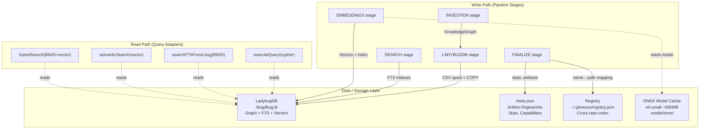
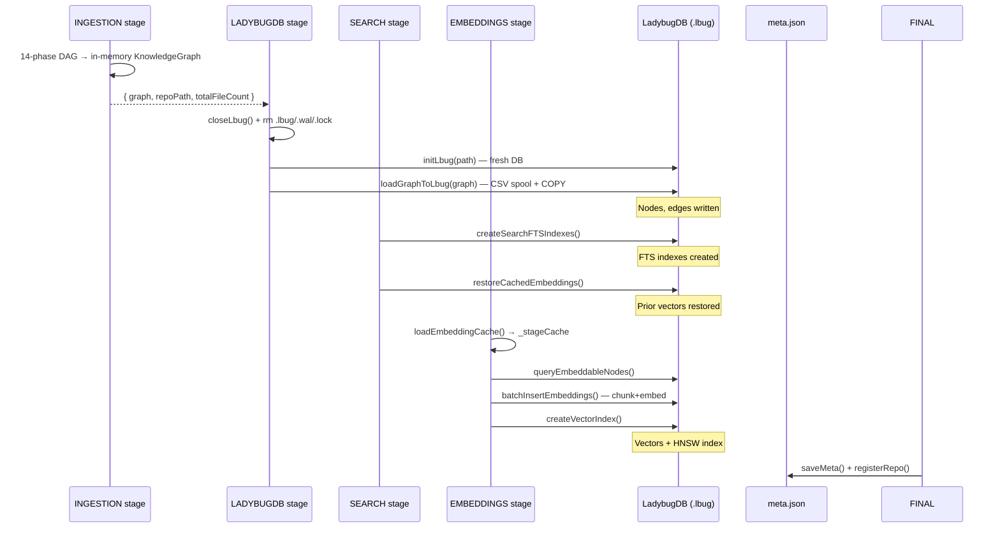
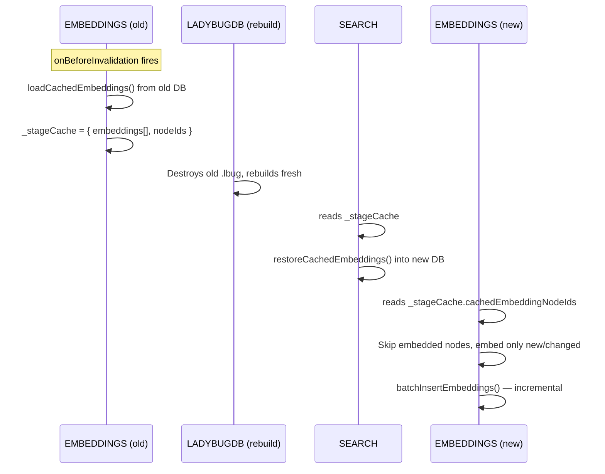

# Data / Storage / Cache Layer

**Location:** `src/core/lbug/`, `src/storage/`, `~/.gitnexus/`
**Philosophy:** Persistent state behind adapter interfaces. Currently dominated by LadybugDB as the sole concrete database.

---

## 1. Overview

The Data Layer comprises four storage systems:



---

## 2. LadybugDB (`@ladybugdb/core` ^0.16.1)

**Role:** Embedded JavaScript graph database that stores the complete indexed code graph, FTS indexes, and vector embeddings.

**Location in repo:** `src/core/lbug/lbug-adapter/` — 14+ adapter functions

### Storage Layout

| Data | Table | Format | Stage |
|------|-------|--------|-------|
| Graph nodes | Node table (per label) | Binary | LADYBUGDB |
| Graph edges | `CodeRelation` table | Binary | LADYBUGDB |
| FTS indexes | Internal FTS tables | Index | SEARCH |
| Vector embeddings | `CodeEmbedding` table | Float32 array | EMBEDDINGS |
| Vector index | Internal vector index | HNSW | EMBEDDINGS |

### Write Path

The write path flows through the PipelineContract stages:



### Read Path

Query adapters expose four reading strategies:

| Function | Location | Signature | Strategy |
|----------|----------|-----------|----------|
| `executeQuery` | `adapter/query.ts` | `(cypher: string) => rows[]` | Raw Cypher, all rows |
| `streamQuery` | `adapter/query.ts` | `(cypher, onRow) => count` | Row-by-row callback |
| `executePrepared` | `adapter/query.ts` | `(cypher, params) => rows[]` | Parameterized reads |
| `executeWithReusedStatement` | `adapter/query.ts` | `(cypher, params[]) => void` | Batch writes |
| `searchFTSFromLbug` | `core/search/bm25-index.ts` | `(query) => ranked[]` | BM25 FTS |
| `hybridSearch` | `core/search/hybrid-search.ts` | `(query) => reranked[]` | Vector + BM25 fusion |
| `semanticSearch` | `core/embeddings/embedding-pipeline.ts` | `(query) => top-K` | Vector index |

### Files Written to Disk

| File Path | Stage | Contents |
|-----------|-------|----------|
| `.gitnexus/{name}/lbug.lb` | LADYBUGDB | LadybugDB binary (graph + FTS + vectors + indexes) |
| `.gitnexus/{name}/lbug.lb.wal` | LADYBUGDB | Write-ahead log |
| `.gitnexus/{name}/lbug.lb.lock` | LADYBUGDB | File lock |

### Hard-Coded Dependency (Critical)

LadybugDB is currently the **only concrete graph database**. All three downstream PipelineContract stages (LADYBUGDB, SEARCH, EMBEDDINGS) directly import its adapter functions. 14+ functions would need abstraction behind a `GraphDatabaseProvider` interface to support alternatives (SQLite, DuckDB, Neo4j).

**Risk:** HIGH. Abstraction effort is significant because LadybugDB-specific concepts (Cypher, CSV spool, internal FTS) leak into stage implementations.

---

## 3. meta.json

**Location:** `.gitnexus/{name}/meta.json`
**Stage:** FINALIZE
**Format:** JSON

### Schema

```typescript
{
  lastCommit: string;           // Git commit hash
  indexedAt: string;            // ISO timestamp
  stats: {
    files: number;
    nodes: number;
    edges: number;
    communities: number;
    processes: number;
    embeddings: number;
  };
  capabilities: string[];       // e.g., ['embeddings', 'fts', 'leiden']
  artifacts: Record<string, {   // Fingerprint tracking
    version: number;
    fingerprint: string;
    producedAt: string;
    clean: boolean;
  }>;
  semanticMode: 'vector-index' | 'exact-scan' | undefined;
}
```

### Artifact Freshness Chain

| Artifact | Fingerprint Basis | Depends On |
|----------|------------------|------------|
| `ingestion` | Git commit hash or directory mtime | — |
| `ladybugdb` | Graph structure hash (node+label distribution) | ingestion |
| `embeddings` | Graph fingerprint + content hashes of embeddable nodes | ingestion, model-config |

Note: Fingerprint `compute()` currently uses timestamp-based fallbacks. The dependency chain is designed for future structural hashing (`descriptors.ts:57-61`).

---

## 4. Registry (`~/.gitnexus/registry.json`)

**Location:** `~/.gitnexus/registry.json` (user home)
**Stage:** FINALIZE
**Format:** JSON

### Schema

```typescript
{
  [name: string]: {
    repoPath: string;
    indexedAt: string;
    lastCommit: string;
  }
}
```

### Purpose

The registry provides:
- Cross-repo discovery (CLI `list`, `status` commands)
- Repo resolution (MCP tool dispatch, server API)
- Unique name registration (`--name` flag disambiguates repos with same basename)

### Location Rationale

User home directory (`~/.gitnexus/`) rather than project directory ensures the registry survives repo deletion and enables multi-repo features across unrelated projects.

---

## 5. ONNX Model Cache

**Model:** `e5-small` (ONNX format, ~690MB)
**Provider:** HuggingFace (`@huggingface/transformers` ^4.1.0)
**Runtime:** ONNX Runtime CPU (`onnxruntime-node` ^1.24.0)
**Download:** Automatic on first embedding run from `huggingface.co`

### Cache Structure

```
~/.cache/huggingface/hub/
└── models--BAAI--bge-small-en-v1.5/
    └── snapshots/
        └── {hash}/
            ├── model.onnx          (~90 MB)
            ├── model.onnx_data    (~600 MB)
            └── tokenizer.json
```

### Embedding Dimensions

- Model: `e5-small` → 384 dimensions
- Chunk size: ~256 tokens (configurable)
- Safety cap: 50,000 nodes (customizable via `--embeddings <n>`)

### Dual Provider Dispatch (`src/core/embeddings/provider.ts`)

From `08-pipeline-architecture-flow-map.md:389-404`:

```
PortabilityContract (selected at bootstrap)
  ├── hasOnnxRuntimeNode=true  → NativeNodeProvider (dev build, CPU)
  │                               onnxruntime-node with AVX support
  │
  └── hasHttpEmbeddings=true   → HTTP client (portable build)
                                  or remote embedding server
```

Both implement `EmbeddingProvider` (`src/core/embeddings/provider.ts`) with `embedBatch()` and `dimensions()`.

---

## 6. Cross-Stage Embedding Cache

**Location:** `_stageCache` in `impl/embedding-stage.ts` (shared module state)
**Pattern:** `onBeforeInvalidation` → `onRestore`

This is the **only** cross-stage data flow that bypasses `PipelineContext.results`:



This cache survives LadybugDB destruction by being in memory (`_stageCache`), restored into the new DB by SEARCH, and consumed by EMBEDDINGS for incremental embedding.

---

## 7. CPU-Only Status by Storage Component

| Component | CPU Load | Memory | Disk | Network | Notes |
|-----------|----------|--------|------|---------|-------|
| LadybugDB write (CSV spool) | Light | Moderate | Write-heavy | None | I/O bound |
| LadybugDB FTS index | Light | Low | Write | None | DB-internal |
| LadybugDB query (Cypher) | Light | Low | Read | None | Indexed |
| ONNX embedding inference | Heavy | 1GB+ | Read model | Download once | CPU AVX |
| meta.json write | Light | Low | Write | None | JSON serialization |
| Registry write | Light | Low | Write | None | JSON serialization |

---

## 8. Abstraction Targets

| Component | Current State | Target Interface | Functions to Abstract | Effort |
|-----------|--------------|-----------------|----------------------|--------|
| Graph database | Hard-coded LadybugDB | `GraphDatabaseProvider` | 14+ (query, stream, prepared, batch, FTS, vector) | HIGH |
| Embedding model | Hard-coded e5-small path | `ModelRegistry` | 2 (load, config) | MEDIUM |
| Model download | Hard-coded HuggingFace | `ModelDownloader` | 1 (download) | LOW |
| File storage | Direct `fs` calls | `StorageProvider` | 3 (saveMeta, loadMeta, getStoragePaths) | LOW |

---

## 9. Key File References

| File | Lines | Purpose |
|------|-------|---------|
| `src/core/lbug/lbug-adapter/query.ts` | — | `executeQuery`, `streamQuery`, `executePrepared` |
| `src/core/lbug/lbug-adapter/index.ts` | — | Barrel exports |
| `src/core/lbug/lbug-stage.ts` | — | Stage 2 concrete (load graph to DB) |
| `src/core/search/fts-indexes.ts` | — | `createSearchFTSIndexes` |
| `src/core/search/hybrid-search.ts` | — | `hybridSearch` (BM25 + vector) |
| `src/core/search/bm25-index.ts` | — | `searchFTSFromLbug` |
| `src/core/embeddings/embedding-pipeline.ts` | — | Embedding sub-pipeline |
| `src/core/embeddings/provider.ts` | — | `EmbeddingProvider` interface |
| `src/core/embeddings/cache-loader.ts` | — | `loadEmbeddingCache`, `restoreCachedEmbeddings` |
| `src/core/analyze/finalizer.ts` | — | `buildMeta`, `saveMeta`, `registerRepo` |
| `src/storage/repo-manager.ts` | — | `saveMeta`, `loadMeta`, `getStoragePaths` |
| `src/storage/repo-manager.ts` | — | Registry file operations |
| `src/core/pipeline-contract/impl/embedding-stage.ts` | — | `_stageCache` cross-stage cache |
