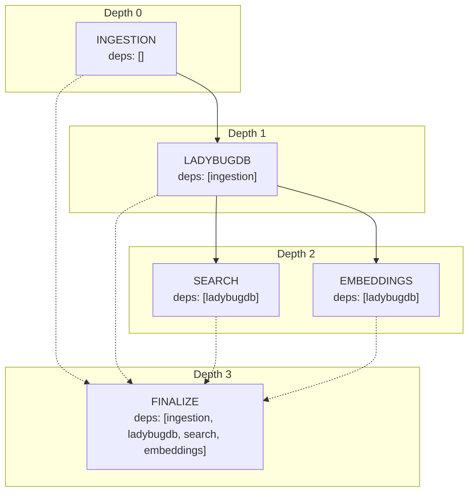
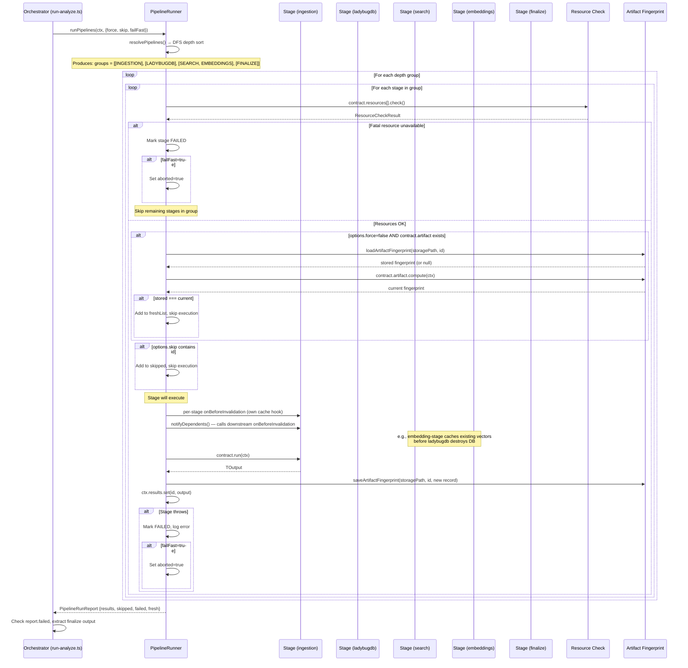

# Meta-Pipeline — PipelineContract System

**Last updated:** 2026-05-15
**Source:** Verified against `src/core/pipeline-contract/types.ts`, `runner.ts`, `descriptors.ts`, `stages.ts`, `index.ts`

---

## 1. Overview

The Meta-Pipeline is a DAG-based stage orchestrator defined by the `PipelineContract<T>` interface. It decouples **what** a stage produces from **when** it runs, giving the system deterministic execution ordering, freshness-based skipping, and cross-stage cache hooks.

```
PipelineContract System (src/core/pipeline-contract/)
├── types.ts          — Contract interfaces (83 lines)
├── runner.ts         — DAG scheduler + executor (194 lines)
├── descriptors.ts    — Stage IDs, deps, resources (61 lines)
├── stages.ts         — Shared type definitions (47 lines)
├── index.ts          — Barrel exports (14 lines)
└── impl/             — 5 concrete stage implementations
    ├── ingestion-stage.ts
    ├── lbug-stage.ts
    ├── search-stage.ts
    ├── embedding-stage.ts
    └── finalize-stage.ts
```

### Layering

| System | Abstraction Level | Runner | Algorithm |
|--------|-------------------|--------|-----------|
| **PipelineContract** (Meta) | 5 high-level stages | `runner.ts` | DFS depth assignment |
| **Ingestion** (sub-pipeline) | 14 phases | `pipeline-phases/runner.ts` | Kahn's topological sort |
| **Embeddings** (sub-pipeline) | 5 sub-phases | Sequential in `embedding-pipeline.ts` | Sequential |

The sub-pipelines are not independently schedulable — they are concretes invoked by `ingestion-stage.ts` and `embedding-stage.ts` respectively.

---

## 2. Core Interfaces (`types.ts:1-83`)

### PipelineContract\<TOutput\> (`types.ts:55-64`)

The contract a stage must fulfill:

| Field | Type | Purpose |
|-------|------|---------|
| `id` | `PipelineId` | Opaque branded string for type-safe identification |
| `label` | `string` | Human-readable label for logging/progress |
| `deps` | `PipelineId[]` | IDs of stages that must complete first |
| `artifact` | `ArtifactFingerprint` (optional) | Freshness computation — skip if fingerprint matches stored |
| `resources` | `ResourceDeclaration[]` | Pre-flight resource checks (fatal or degrade) |
| `onBeforeInvalidation` | hook (optional) | Called before an upstream stage runs; return a `CachePayload` |
| `onRestore` | hook (optional) | Called after cache data is restored |
| `run(ctx)` | async function | The stage's execution body; returns `TOutput` |

### PipelineContext (`types.ts:35-46`)

Shared context passed to every stage:

```typescript
interface PipelineContext {
  repoPath: string;
  storagePath: string;
  lbugPath: string;
  options: AnalyzeOptions;
  callbacks: AnalyzeCallbacks;
  results: Map<PipelineId, unknown>;  // ← populated by runner after each stage
  tempDir: string;
  config?: PortableConfig;
  log: (msg: string) => void;
  progress: (phase: string, percent: number, message: string) => void;
}
```

`results` is the primary inter-stage data channel. Stage A stores its output at `PipelineId=A`; Stage B (dependending on A) reads `ctx.results.get(pid(STAGE_IDS.A))`.

### PipelineRunOptions (`types.ts:66-71`)

Controls execution behavior:

| Option | Type | Effect |
|--------|------|--------|
| `force` | `boolean` | Ignore artifact freshness; always re-run |
| `only` | `PipelineId[]` | Run only these stages (and their transitive deps) |
| `skip` | `PipelineId[]` | Explicitly skip stages (neither run nor fail) |
| `failFast` | `boolean` | Abort on first failure; mark remaining as skipped |

### PipelineRunReport (`types.ts:73-78`)

Returned by `runner.runPipelines()`:

| Field | Type | Purpose |
|-------|------|---------|
| `results` | `Map<PipelineId, {output, artifact, durationMs}>` | Outputs of successfully completed stages |
| `skipped` | `PipelineId[]` | Stages that were skipped (via `skip` set or abort) |
| `failed` | `PipelineId[]` | Stages that failed (resource or execution error) |
| `fresh` | `PipelineId[]` | Stages that were up-to-date and skipped via freshness |

### ArtifactRecord / ArtifactFingerprint (`types.ts:9-19`)

```typescript
interface ArtifactRecord {
  version: number;
  fingerprint: string;
  producedAt: string;
  clean: boolean;
}

interface ArtifactFingerprint {
  version: number;
  compute: (ctx: PipelineContext) => string;
}
```

### ResourceDeclaration / CachePayload (`types.ts:21-33`)

```typescript
interface ResourceDeclaration {
  id: string;
  label: string;
  criticality: 'fatal' | 'degrade' | 'warn';
  helpUrl?: string;
  check: () => ResourceCheckResult;
}

type CachePayload =
  | { type: 'none' }
  | { type: 'embeddings'; data: { embeddings: unknown[]; totalNodes: number } };
```

The `CachePayload` discriminated union allows different stage types to express what data they need to preserve. Currently only `'embeddings'` is used (by the embedding stage's `onBeforeInvalidation`).

---

## 3. DAG Resolution (`runner.ts:4-52`)

### DFS Depth Assignment

`resolvePipelines()` at `runner.ts:4-52` assigns each stage a **depth** equal to `max(dep depths) + 1`:



**Algorithm** (`runner.ts:13-35`):
1. Start with a set of requested stage IDs
2. For each, run DFS: mark `visited`, add to `stack`, recurse into deps
3. When backtracking: `depth = max(dep depths) + 1`, add to `depths` map
4. If a node is already on the `stack` → circular dependency detected (error)
5. After all DFS completes: sort stages by depth into execution groups

**Execution order groups:** Stages at the same depth run sequentially in registration order. No parallelism currently, but the depth grouping makes it architecturally possible.

### Cycle Detection

A `Set<PipelineId>` called `stack` tracks the current DFS path. If DFS encounters a node already on `stack`, it throws:

```
Circular dependency detected for pipeline: {id}
```

### Skip Set Integration

The runner checks `options.skip` at `runner.ts:145-148`. Skipped stages are added to the `skipped` list in the report but do **not** fail. This is how `run-analyze.ts` implements the "embeddings-only" re-run mode: it adds `ingestion`, `ladybugdb`, and `search` to the skip set.

---

## 4. Full Runner Flow



---

## 5. Artifact Freshness (`runner.ts:133-142`)

Freshness is how the runner avoids re-executing a stage whose inputs have not changed.

### Lifecycle

1. **After execution**, the runner persists an `ArtifactRecord` to `meta.json`:
   ```typescript
   artifact = {
     version: contract.artifact.version,
     fingerprint: contract.artifact.compute(ctx),
     producedAt: new Date().toISOString(),
     clean: true,
   };
   await saveArtifactFingerprint(ctx.storagePath, id, artifact);
   ```

2. **Before execution**, the runner loads the stored record and compares:
   ```typescript
   const stored = await loadArtifactFingerprint(ctx.storagePath, id);
   if (stored) {
     const current = contract.artifact.compute(ctx);
     if (stored.fingerprint === current) {
       freshList.push(id);
       continue;  // ← skip execution
     }
   }
   ```

3. **`force: true`** bypasses the check entirely.

### Per-Stage Fingerprints

| Stage | Version | `compute()` logic |
|-------|---------|-------------------|
| INGESTION | 1 | Git commit hash via `getCurrentCommit()`, or `force-{timestamp}` when `options.force` is set, or `mtime-{timestamp}` if git is unavailable |
| LADYBUGDB | 1 | `graph-{Date.now()}` — always re-runs (fingerprint is just a recency proxy) |
| SEARCH | 1 | `fts-{Date.now()}` — always re-runs |
| EMBEDDINGS | 1 | `emb-{Date.now()}` — always re-runs |
| FINALIZE | — | No artifact declared — always re-runs |

The current implementation is **conservative**: most stages use a timestamp to guarantee re-execution. True incremental freshness (e.g., comparing graph structure hash for LADYBUGDB) is declared in `STAGE_ARTIFACTS` at `descriptors.ts:57-61` but not yet implemented in the concrete stages.

---

## 6. Resource Declarations (`descriptors.ts:27-49`)

Each stage declares resource requirements with a `criticality` level. The runner iterates `contract.resources` at `runner.ts:121-131` before execution:

```typescript
for (const res of contract.resources) {
  const status = res.check();
  if (!status.available && res.criticality === 'fatal') {
    canRun = false;
    failed.push(id);
    if (options.failFast) aborted = true;
    break;
  }
}
```

| Stage | Fatal Resources | Degrade Resources |
|-------|----------------|-------------------|
| INGESTION | `wasm-runtime` (web-tree-sitter), `source-files` | `grammars` (language parsers) |
| LADYBUGDB | `ladybugdb-core`, `disk-space` | — |
| SEARCH | `ladybugdb-core` | — |
| EMBEDDINGS | `embedding-model` (ONNX), `onnx-runtime`, `memory` (~1GB) | `model-cap` (50K node cap) |
| FINALIZE | `filesystem` (write access) | — |

**Note:** All concrete stages currently return `{ available: true }` for every resource (`runner.ts:28-29` in each impl file). The resource declarations describe **intent** — they document what each stage needs but the actual checks are stubs.

---

## 7. Cache Hooks (`runner.ts:74-87, 150-153`)

### onBeforeInvalidation

Before an upstream stage runs, the runner notifies dependent stages:

```typescript
for (const [id, contract] of contracts) {
  if (contract.deps.includes(upstreamId) && contract.onBeforeInvalidation) {
    const payload = await contract.onBeforeInvalidation(ctx);
    payloads.set(id, payload);
  }
}
```

This is used by the **embedding stage** (`embedding-stage.ts:59-83`) to cache existing embeddings before LadybugDB is rebuilt:

1. `embedding-stage.onBeforeInvalidation()` detects LadybugDB will run and loads existing vectors from the DB into `_stageCache` (an in-memory module-level variable)
2. The LADYBUGDB stage destroys the DB files and rebuilds from scratch
3. The SEARCH stage reads `_stageCache` via `getStageCache()` and calls `restoreCachedEmbeddings()` to re-insert cached vectors into the new DB
4. The EMBEDDINGS stage reads `_stageCache.cachedEmbeddingNodeIds` and uses them as `skipNodeIds` — only new/changed nodes get embedded

```
embedding-stage.ts:59-83   → onBeforeInvalidation → loadEmbeddingCache() → _stageCache
lbug-stage.ts:29-59         → closeLbug() + rm files + initLbug() + loadGraphToLbug()
search-stage.ts:23-39       → getStageCache() → restoreCachedEmbeddings()
embedding-stage.ts:85-188   → getStageCache() → runEmbeddingPipeline(skipNodeIds)
```

### onRestore

The `onRestore` hook (declared in `PipelineContract` at `types.ts:62`) is defined but **not currently used by any stage**. It exists for future use where a downstream stage needs to explicitly acknowledge and process restored cache data.

---

## 8. Integration with `run-analyze.ts`

`run-analyze.ts:45-154` is the orchestrator that wires everything together:

```
runFullAnalysis(repoPath, options, callbacks, portableConfig):
  1. Resolve storage paths (respecting portableConfig.output_path override)
  2. Check for KuzuDB migration
  3. Early-return check: if repo up-to-date and embeddings exist → return immediately
  4. Build PipelineContext
  5. Register 5 PipelineContracts on a Map
  6. Create PipelineRunner via createPipelineRunner(contracts)
  7. Determine skip set:
     - If graph is up-to-date but embeddings are missing → skip [INGESTION, LADYBUGDB, SEARCH]
  8. initLbug() — ensures DB is open (needed when ladybugdb stage is skipped)
  9. runner.runPipelines(ctx, {force, skip, failFast: true})
  10. Check report.failed → throw on failure
  11. Extract finalize output → return AnalyzeResult
```

Key design choices:
- **`failFast: true`** always — any single stage failure aborts the pipeline
- **Skip set construction** uses `options.skip` rather than forcing stage IDs into the `only` set — this allows the DAG to resolve all transitive deps but selectively skip specific stages
- **LadybugDB lifecycle** is managed externally: `initLbug()` is called before `runPipelines()` (not by the lbug stage itself), and `closeLbug()` is called in error paths. This is necessary because the skip set may skip the LADYBUGDB stage, but the DB must still be open for subsequent stages.

---

## 9. Dual Pipeline Nesting

Two of the 5 stages invoke their own sub-pipelines:

```
PipelineContract (Meta-Pipeline)
├── INGESTION ─────────────────────────────────────┐
│   calls runPipelineFromRepo()                   │
│   ├── Kahn's topological sort (pipeline-phases/)│
│   ├── 10-14 phases (scan → ... → processes)     │
│   ├── Mutable KnowledgeGraph (graph accumulator) │
│   └── Progress: scaled to 0-60% of total         │
├── LADYBUGDB ─────────────────────────────────────┤
│   calls loadGraphToLbug()                        │
│   ├── CSV spool + COPY pattern                   │
│   └── Progress: scaled 60-84%                    │
├── SEARCH ────────────────────────────────────────┤
│   calls createSearchFTSIndexes()                 │
│   └── Progress: 85-90%                           │
├── EMBEDDINGS ────────────────────────────────────┤
│   calls runEmbeddingPipeline()                   │
│   ├── 5 sequential sub-phases                    │
│   │   1. Load model (download if needed)         │
│   │   2. Query embeddable nodes from DB          │
│   │   3. Chunk + embed in batches                │
│   │   4. Create vector index                     │
│   │   5. Ready                                   │
│   ├── Dual backend: NativeNodeProvider vs HTTP   │
│   ├── Incremental mode via skipNodeIds           │
│   └── Progress: scaled 90-98%                    │
└── FINALIZE ──────────────────────────────────────┘
    └── Progress: 98-100%
```

---

## 10. Current Limitations

| Limitation | Detail | Impact |
|------------|--------|--------|
| No parallelism | Stages at same depth run sequentially in registration order | SEARCH and EMBEDDINGS could run concurrently |
| Timestamp fingerprints | 3 of 5 stages use `Date.now()` — only INGESTION has a meaningful fingerprint (git commit hash) | Full re-run every time |
| Resource checks are stubs | All `check()` return `{ available: true }` | Pre-flight validation is aspirational |
| LadybugDB dependency leak | `run-analyze.ts` calls `initLbug()` directly | Breaks abstraction if DB provider changes |
| Cache is module-level | `_stageCache` is a mutable module variable (`embedding-stage.ts:35-38`) | Not thread-safe; cache lifecycle is implicit |
| `onRestore` unused | Declared but no stage implements it | Dead code in the interface |
