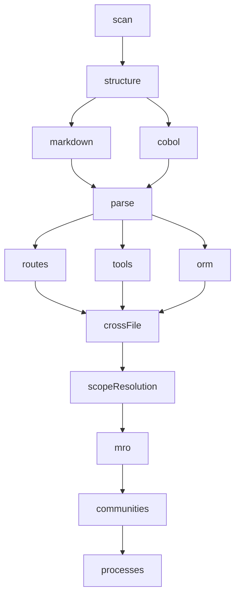

# Indexing Pipeline — 5 DAG Stages

**Last updated:** 2026-05-15
**Source:** Verified against `src/core/pipeline-contract/impl/`, `src/core/ingestion/pipeline.ts`, `src/core/embeddings/embedding-pipeline.ts`

---

## 1. Overview

The Indexing Pipeline is the primary execution flow of the Meta-Pipeline. It takes a repository path and produces a fully indexed knowledge graph with FTS search, embeddings, and metadata. It consists of 5 stages connected as a dependency DAG, each backed by concrete implementations in `src/core/pipeline-contract/impl/`.

```
Progress:  0%           60%          84%    90%       98%  100%
           ├─────────────├──────────────├──────├──────────├─────┤
           Ingestion     LadybugDB    Search Embeddings Finalize
           (14 phases)   (CSV spool)  (FTS)  (ONNX)     (meta)
```

---

## 2. Stage 1 — Ingestion (`impl/ingestion-stage.ts:1-42`)

### Purpose
Parse every source file in the repository using tree-sitter AST parsing and build the in-memory `KnowledgeGraph`.

### Concrete
`runPipelineFromRepo()` from `src/core/ingestion/pipeline.ts:96-150`

### Dependencies
| Dependency | Package | Version | Type |
|------------|---------|---------|------|
| Tree-sitter native | `tree-sitter` | ^0.21.1 | Native C addon (node-gyp) |
| Tree-sitter WASM | `web-tree-sitter` | ^0.26.8 | WASM (platform-agnostic) |
| 12 language parsers | `tree-sitter-{c,cpp,c-sharp,go,java,javascript,php,python,ruby,rust,typescript}` | Various | Native C addon |
| 5 vendored parsers | `tree-sitter-{dart,kotlin,proto,swift}` + 1 more | Vendored | Native C addon |

### Phase Dependency Diagram (14-Phase Ingestion DAG)



**Phase details:**

| Phase | File | Purpose |
|-------|------|---------|
| `scan` | `pipeline-phases/scan.ts` | Find all source files via glob, respecting .gitignore |
| `structure` | `pipeline-phases/structure.ts` | Identify project structure, package boundaries |
| `markdown` | `pipeline-phases/markdown.ts` | Parse Markdown documentation files |
| `cobol` | `pipeline-phases/cobol.ts` | Parse COBOL source files |
| `parse` | `pipeline-phases/parse.ts` | Tree-sitter AST parsing (worker pool for parallel file processing) |
| `routes` | `pipeline-phases/routes.ts` | Extract HTTP route definitions |
| `tools` | `pipeline-phases/tools.ts` | Extract tool definitions |
| `orm` | `pipeline-phases/orm.ts` | Extract ORM entity definitions |
| `crossFile` | `pipeline-phases/cross-file.ts` | Cross-file reference resolution (imports, exports) |
| `scopeResolution` | `pipeline-phases/scope-resolution` | Scope resolution for identifiers |
| `mro` | `pipeline-phases/mro.ts` | Method Resolution Order (inheritance chain resolution) |
| `communities` | `pipeline-phases/communities.ts` | Leiden community detection on function/class graph |
| `processes` | `pipeline-phases/processes.ts` | Extract execution flows from graph |

### Artifact Fingerprint
- **Version:** 1
- **Compute:** Git commit hash via `getCurrentCommit()` or `force-{Date.now()}` or `mtime-{Date.now()}`
- **Stored in:** `meta.json#artifacts.ingestion`

### Resources
| Resource | Criticality | Purpose |
|----------|-------------|---------|
| `wasm-runtime` | **fatal** | web-tree-sitter WASM runtime |
| `grammars` | degrade | Tree-sitter language grammars (degrade = run with fewer languages) |
| `source-files` | **fatal** | Source code files to analyze |

### CPU Status
**CPU-heavy.** Tree-sitter parsing is CPU-bound (single-threaded WASM or native C). Worker pool for parallel file processing across multiple cores.

### Swappability
**Not swappable** without refactoring. `ingestion-stage.ts` directly imports `runPipelineFromRepo`. Would need a `ParserProvider` interface.

### Key Output
```typescript
interface IngestionOutput {
  graph: KnowledgeGraph;  // in-memory graph with all nodes/edges
  repoPath: string;
}
```

The knowledge graph is a mutable accumulator — phases add nodes and edges to `graph`. The entire 14-phase DAG operates on this shared graph instance, created at `pipeline.ts:101` via `createKnowledgeGraph()`.

---

## 3. Stage 2 — LadybugDB (`impl/lbug-stage.ts:1-62`)

### Purpose
Destroy the existing LadybugDB database files and rebuild from scratch using the in-memory `KnowledgeGraph`. This is a destructive rebuild pattern.

### Concrete
`closeLbug()` + `initLbug()` + `loadGraphToLbug()` from `src/core/lbug/lbug-adapter.js`

### Process
```
1. closeLbug()           — Close existing DB connection
2. fs.rm(lbugPath, *)    — Delete DB files (destructive)
3. initLbug(lbugPath)    — Create new empty DB
4. loadGraphToLbug()     — CSV spool → COPY nodes/edges into DB
```

### Progress Scaling
The stage reports progress from 60% to 84% of the total pipeline. Uses a diminishing-returns estimator: `60 + min(24, msgCount / (msgCount + 10) * 24)`.

### Artifact Fingerprint
- **Version:** 1
- **Compute:** `graph-{Date.now()}` (always re-runs)

### Resources
| Resource | Criticality | Purpose |
|----------|-------------|---------|
| `ladybugdb-core` | **fatal** | @ladybugdb/core package |
| `disk-space` | **fatal** | Disk space for DB files |

### CPU Status
**CPU-light.** I/O bound (CSV spool + DB writes).

### Swappability
**Not swappable** — direct imports of LadybugDB adapter functions (`closeLbug`, `initLbug`, `loadGraphToLbug`). Needs a `GraphDatabaseProvider` interface.

### Key Output
Returns `void`. Side-effect: populated LadybugDB database with nodes, edges, communities, and processes.

---

## 4. Stage 3 — Search (`impl/search-stage.ts:1-41`)

### Purpose
Create FTS (Full Text Search) indexes on LadybugDB for File, Function, Class, Interface, and other node types. Also restores cached embeddings from the previous pipeline run (if any) to avoid re-embedding unchanged nodes.

### Concrete
`createSearchFTSIndexes()` from `src/core/search/fts-indexes.js` + `restoreCachedEmbeddings()` from `src/core/embeddings/cache-loader.js`

### Embedding Cache Restore Flow
```
search-stage.ts:28-38
├── getStageCache() → reads _stageCache (set by onBeforeInvalidation)
├── if cache has cachedEmbeddings.length > 0:
│   └── restoreCachedEmbeddings(cachedEmbeddings, executeWithReusedStatement, ...)
│       └── Re-inserts vectors into new LadybugDB
│       └── Returns updated cache (removes stale entries)
└── cache is available for embedding-stage.ts downstream
```

This is the **restore** half of the cache pattern: onBeforeInvalidation (embeddings) → store, ladybugdb rebuilds DB, search restores cached vectors.

### Artifact Fingerprint
- **Version:** 1
- **Compute:** `fts-{Date.now()}` (always re-runs)

### Resources
| Resource | Criticality | Purpose |
|----------|-------------|---------|
| `ladybugdb-core` | **fatal** | @ladybugdb/core package |

### CPU Status
**CPU-light.** FTS index creation is database-internal.

### Swappability
Tied to LadybugDB FTS capabilities. Alternative DB would bring its own FTS.

### Key Output
Returns `void`. Side-effect: FTS indexes created on LadybugDB.

---

## 5. Stage 4 — Embeddings (`impl/embedding-stage.ts:1-190`)

### Purpose
Generate semantic vector embeddings for all embeddable nodes in the knowledge graph using ONNX Runtime CPU inference with the `e5-small` model. Optionally supports incremental mode via cached embeddings.

### Concrete
`runEmbeddingPipeline()` from `src/core/embeddings/embedding-pipeline.ts:174-496`

### 5 Sub-Phases

```
runEmbeddingPipeline()
├── Phase 1: Load Model ──────────────────────────────────────
│   ├── isEmbedderReady() check
│   ├── initEmbedder() with model download progress callback
│   └── e5-small ONNX model (~690MB from huggingface.co)
│
├── Phase 2: Query Embeddable Nodes ─────────────────────────
│   ├── findUnprocessedNodes() from LadybugDB via EmbeddingRepository
│   ├── Apply repo/server context metadata
│   ├── Incremental mode: compare content hashes
│   │   ├── New node → embed
│   │   ├── Changed node → DELETE stale + re-embed
│   │   └── Unchanged node → skip
│   └── DELETE stale rows (Kuzu-sanctioned pattern for vector-indexed props)
│
├── Phase 3: Chunk + Embed ──────────────────────────────────
│   ├── Batch processing (configurable batchSize/subBatchSize)
│   ├── AST-aware chunkNode() with character fallback
│   ├── structural name extraction for class-like nodes
│   ├── embedBatch() via dual backend dispatch
│   └── batchStoreEmbeddings() to LadybugDB
│
├── Phase 4: Create Vector Index ─────────────────────────────
│   └── initializeVectorIndex() on EmbeddingRepository
│
└── Phase 5: Ready ───────────────────────────────────────────
    └── Return {nodesProcessed, chunksProcessed, vectorIndexReady, semanticMode}
```

### Embedding Config (`stages.ts:17-24`)

```typescript
interface EmbeddingConfig {
  modelId: string;        // e.g., 'Xenova/e5-small-v2'
  dimensions: number;     // 384
  modelDir: string;       // path to cached ONNX model
  backend: Device;        // 'wasm' | 'cpu' | 'cuda' | 'dml' | 'remote'
  allowRemoteModels: boolean;
  allowLocalModels: boolean;
}
```

### Dual Backend Dispatch

The `EmbeddingProvider` interface at `src/core/embeddings/provider.ts` defines `embedBatch()` and `dimensions()`. Two implementations exist:

| Provider | Backend | Platform | Selection |
|----------|---------|----------|-----------|
| `NativeNodeProvider` | ONNX Runtime native (`onnxruntime-node` ^1.24.0) | Node.js with native addons | Default when `hasOnnxRuntimeNode` |
| HTTP client | Remote HTTP endpoint | Portable builds | `isHttpMode()` check at `embedding-stage.ts:124` |

### Incremental Mode

When `_stageCache.cachedEmbeddingNodeIds` has entries (restored by SEARCH stage), the embedding pipeline:
1. Maps cached node IDs to their content hashes
2. For each node: if hash matches → skip; if hash changed → DELETE + re-embed; if not in cache → embed fresh
3. The DELETE-then-INSERT pattern is required by KuzuDB for vector-indexed properties

### Content Hash Computation

```
contentHashForNode(node, config):
  text = generateEmbeddingText(node, node.content, config)
  return sha1(EMBEDDING_TEXT_VERSION + '\n' + text)
```

The `EMBEDDING_TEXT_VERSION` constant (`'v2'` at `embedding-pipeline.ts:56`) must be bumped when the embedding text template changes in a way that invalidates existing vectors.

### Artifact Fingerprint
- **Version:** 1
- **Compute:** `emb-{Date.now()}` (always re-runs)

### Resources
| Resource | Criticality | Purpose |
|----------|-------------|---------|
| `embedding-model` | **fatal** | ONNX model files (~690MB) |
| `onnx-runtime` | **fatal** | ONNX Runtime (WASM or native) |
| `memory` | **fatal** | ~1GB+ RAM required |
| `model-cap` | degrade | 50K node safety cap (default: `DEFAULT_EMBEDDING_NODE_LIMIT`) |

### CPU Status
**CPU-heavy.** ONNX Runtime CPU inference (AVX support). GPU declarations (`'cuda' | 'dml'`) exist in the `Device` type but are never consumed.

### Swappability
**Partially swappable** — the `EmbeddingProvider` interface exists with `embedBatch()` and `dimensions()`. Model path, dimensions (384), chunk size, and overlap are currently hard-coded.

### Key Output
```typescript
interface EmbeddingResult {
  semanticMode: 'vector-index' | 'exact-scan' | undefined;
  embeddingsCount: number;
}
```

---

## 6. Stage 5 — Finalize (`impl/finalize-stage.ts:1-82`)

### Purpose
Count embeddings, build metadata, save to disk, register the repository, and generate AI context files for downstream tools.

### Concrete
`countEmbeddings()` + `buildMeta()` from `src/core/analyze/finalizer.js`

### Process
```
1. getLbugStats()           — query node/edge counts from DB
2. countEmbeddings()        — query embedding count
3. Validate: if embeddings ran but count is 0 → throw (data integrity)
4. buildMeta()              — construct AnalysisMetadata
5. closeLbug()              — close DB connection
6. Return AnalyzeResult
```

### Validation Guard
```typescript
if (!embeddingSkipped && stats.nodes > 0 && embeddingCount === 0) {
  throw new Error(
    'Embedding generation completed without persisted embeddings. ' +
    'The index was not registered to avoid silently reporting embeddings: 0.'
  );
}
```

### Artifact Fingerprint
None — always re-runs.

### Resources
| Resource | Criticality | Purpose |
|----------|-------------|---------|
| `filesystem` | **fatal** | Write access to `.gitnexus/` |

### CPU Status
**CPU-light.** I/O bound (file system writes and metadata construction).

### Swappability
**Yes** — stateless and trivial, already abstracted behind `PipelineContext`.

### Key Output
```typescript
interface AnalyzeResult {
  repoName: string;
  repoPath: string;
  stats: { nodes: number; edges: number; files: number; embeddings: number };
  pipelineResult: IngestionOutput | undefined;
}
```

---

## 7. Cross-Stage Data Flow

```
Stage 1: INGESTION
├── Output: IngestionOutput { graph, repoPath }
└── ctx.results.set('ingestion', output)

Stage 2: LADYBUGDB
├── Reads: ctx.results.get('ingestion').graph
├── Output: void (DB populated via CSV spool)
└── _stageCache: may contain pre-saved embeddings (set by onBeforeInvalidation)

Stage 3: SEARCH
├── Reads: _stageCache (via getStageCache())
├── Output: void (FTS indexes created, embeddings restored)
└── Updates: _stageCache (removes stale entries after restoration)

Stage 4: EMBEDDINGS
├── Reads: _stageCache (skipNodeIds for incremental mode)
├── Reads: ctx.results.get('ingestion') for project name
├── Output: EmbeddingResult { semanticMode, embeddingsCount }
└── ctx.results.set('embeddings', output)

Stage 5: FINALIZE
├── Reads: ctx.results.get('ingestion').graph
├── Reads: ctx.results.get('embeddings').semanticMode
├── Output: AnalyzeResult
└── Side-effect: meta.json saved, DB closed
```

---

## 8. CPU-Only Status by Stage

| Stage | CPU Load | GPU | Memory | Disk | Network |
|-------|----------|-----|--------|------|---------|
| INGESTION | Heavy (parsing) | None | Moderate | Read-heavy | None |
| LADYBUGDB | Moderate (CSV) | None | Moderate | Write-heavy | None |
| SEARCH | Light (FTS) | None | Low | Write (index) | None |
| EMBEDDINGS | Heavy (ONNX) | None | 1GB+ | Read model | Optional (model download, HTTP endpoint) |
| FINALIZE | Light | None | Low | Write meta | None |

**Total pipeline: 100% CPU, 0% GPU.**

---

## 9. Swappability Summary

| Stage | Has Interface? | Swap Difficulty | What Would Be Needed |
|-------|---------------|-----------------|---------------------|
| INGESTION | No | High | `ParserProvider` interface; tree-sitter is embedded in 17+ files |
| LADYBUGDB | No | High | `GraphDatabaseProvider`; 14+ adapter functions across 3 stages |
| SEARCH | No | Medium | Alternative DB already provides FTS; LadybugDB-specific calls |
| EMBEDDINGS | Partial | Medium | `EmbeddingProvider` exists; model config hard-coded |
| FINALIZE | Yes | Low | Already abstracted — no direct DB or parser dependency |

---

## 10. Cross-References

- **PipelineContract types:** See `00-Meta-Pipeline.md:2.1` for `PipelineContract<T>` interface
- **DAG resolution:** See `00-Meta-Pipeline.md:3` for DFS depth assignment algorithm
- **Cache hooks:** See `00-Meta-Pipeline.md:7` for onBeforeInvalidation lifecycle
- **Boost Pipeline (proposed):** See `02-Boost-Pipeline.md` — LLM enrichment runs after indexing completes
- **Post-Pipeline Processors:** See `02-Business-Logic-Layer.md:4` for cluster enricher, graph layout, and node description generation
