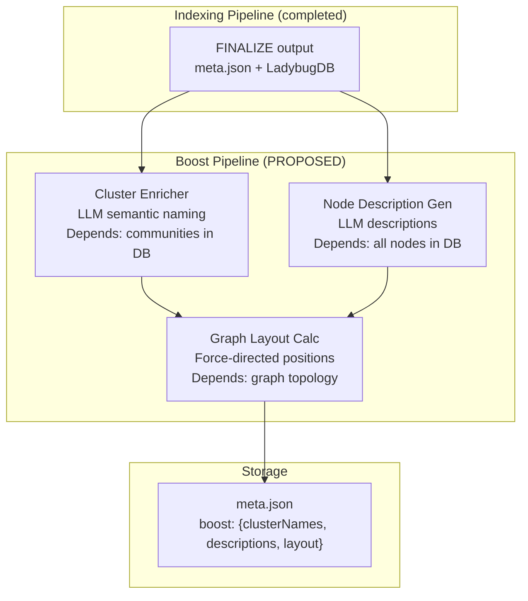

# Boost Pipeline — LLM-Powered Enrichment (Proposed)

**Last updated:** 2026-05-15
**Status:** ⚠️ **TARGET STATE** — This describes a proposed pipeline. None of these stages exist in `src/core/` today. The components listed here currently live in `ui/src/` and must be extracted into the Business Logic Layer.

---

## 1. Purpose

The Boost Pipeline runs **after** the Indexing Pipeline completes. It uses LLM calls to enrich the indexed knowledge graph with semantic labels, descriptions, and visual layout information. Unlike the Indexing Pipeline (deterministic, CPU-only), the Boost Pipeline is LLM-dependent, network-accessible, and optional.

```
Indexing Pipeline     Boost Pipeline (proposed)     Query Pipeline
─────────────────     ─────────────────────────     ──────────────
INGESTION ──────────► Cluster Enricher ──────────►  (read-only)
LADYBUGDB ──────────► Node Description Gen ──────►  (read-only)
SEARCH ─────────────► Graph Layout Calc ─────────►  (read-only)
EMBEDDINGS ─────────►
FINALIZE ───────────►
```

---

## 2. Proposed Architecture



### Stage Registration

The Boost Pipeline would be registered on the same `PipelineRunner` as 3 new contracts:

| Stage ID | Label | Dependencies | Artifact Depends On |
|----------|-------|-------------|---------------------|
| `cluster-enrich` | LLM Cluster Enrichment | `embeddings`, `finalize` | Embeddings fingerprint |
| `node-describe` | LLM Node Description | `embeddings`, `finalize` | Embeddings fingerprint |
| `graph-layout` | Graph Layout Calculation | `cluster-enrich`, `node-describe` | Cluster + description fingerprints |

### Execution Mode

Unlike the Indexing Pipeline (always runs on `analyze`), the Boost Pipeline should be:
- **Opt-in**: invoked via `gitnexus boost` or `gitnexus analyze --boost`
- **Idempotent**: artifacts stored in `meta.json#boost` allow skipping if unchanged
- **Fail-graceful**: LLM API failure should degrade, not crash — use `criticality: 'degrade'`

---

## 3. Component 1 — Cluster Enricher

### Current Location (Violation)
`ui/src/core/ingestion/cluster-enricher.ts:1-243`

### Target Location
`src/core/post-pipeline/cluster-enricher.ts`

### Purpose
Take Leiden community clusters from the knowledge graph and use an LLM to generate semantic names, keywords, and descriptions for each cluster.

### Core Types (to be defined)

```typescript
interface CommunityNode {
  id: string;
  label: string;
  heuristicLabel: string;   // auto-generated from dominant symbol names
  cohesion: number;         // community detection quality metric
  symbolCount: number;
}

interface ClusterMemberInfo {
  name: string;
  filePath: string;
  type: 'Function' | 'Class' | 'Method' | 'Interface';
}

interface ClusterEnrichment {
  name: string;             // LLM-generated semantic name (e.g., "Authentication Module")
  keywords: string[];       // relevant search keywords
  description: string;      // one-sentence summary
}

interface EnrichmentResult {
  enrichments: Map<string, ClusterEnrichment>;
  tokensUsed: number;
}
```

### LLM Prompt Strategy (`cluster-enricher.ts:45-57`)

Two modes:

1. **Per-cluster** (`enrichClusters()` at `cluster-enricher.ts:101-147`):
   - One LLM call per cluster (limited to 20 members to control tokens)
   - Prompt: heuristic label + member list → JSON `{"name", "description"}`
   - Fallback: heuristic label if LLM fails

2. **Batch** (`enrichClustersBatch()` at `cluster-enricher.ts:157-243`):
   - 5 clusters per call (configurable `batchSize`)
   - Returns JSON array
   - More token-efficient but requires larger context window

### LLM Client Interface

```typescript
interface LLMClient {
  generate: (prompt: string) => Promise<string>;
}
```

### Dependencies (to move from UI to Root)

| Package | Current Version (UI) | Purpose |
|---------|---------------------|---------|
| `@langchain/core` | ^1.1.44 | LangChain primitives |
| `@langchain/anthropic` | ^1.3.29 | Anthropic Claude client |
| `@langchain/openai` | ^1.4.5 | OpenAI client |
| `@langchain/google-genai` | ^2.1.28 | Google Gemini client |
| `@langchain/ollama` | ^1.2.6 | Ollama local client |
| `@langchain/langgraph` | ^1.2.9 | Agentic state management |
| `langchain` | ^1.3.5 | Orchestration |
| `zod` | ^3.25.76 | Schema validation |

### Resource Requirements

| Resource | Criticality | Purpose |
|----------|-------------|---------|
| `llm-api-key` | **fatal** | LLM provider API key |
| `network-access` | **fatal** | Outbound HTTP to LLM API |
| `tokens` | degrade | Token budget / rate limiting |

---

## 4. Component 2 — Node Description Generator

### Current Location (Violation)
Inlined in UI logic — no single file, spread across components.

### Target Location
`src/core/post-pipeline/node-desc-generator.ts`

### Purpose
Generate natural language descriptions for indexed nodes (Functions, Classes, Interfaces) using an LLM. Unlike the Cluster Enricher (cluster-level), this operates at the node level.

### Proposed Types

```typescript
interface NodeDescription {
  nodeId: string;
  description: string;        // LLM-generated
  oneLiner: string;           // single-line summary
  tags: string[];             // extracted tags
  confidence: number;         // LLM confidence score
}
```

### Design Notes

- Should only process nodes without existing descriptions (incremental)
- Should batch nodes for token efficiency (5-10 per call)
- Descriptions should be stored as node properties in LadybugDB, not separate files
- Should respect a per-repo token budget to avoid surprise bills

---

## 5. Component 3 — Graph Layout Calculator

### Current Location (Violation)
UI-side via npm packages:
- `graphology-layout-force` (^0.2.4)
- `graphology-layout-forceatlas2` (^0.10.1)
- `graphology-layout-noverlap` (^0.4.2)

### Target Location
`src/core/post-pipeline/graph-layout.ts`

### Purpose
Compute force-directed node positions server-side and cache them in `meta.json`. Currently the UI computes layouts on every page load, which is wasteful for large graphs.

### Proposed Interface

```typescript
interface GraphLayoutConfig {
  algorithm: 'force' | 'forceatlas2' | 'noverlap';
  iterations?: number;       // default: 100
  settings?: Record<string, unknown>;  // algorithm-specific
}

interface GraphLayoutResult {
  positions: Map<string, { x: number; y: number }>;
  algorithm: string;
  iterations: number;
  durationMs: number;
  convergence: number;       // quality metric
}
```

### Rationale

- **Deterministic** — layout with fixed seed produces same positions
- **Cachable** — stored as `meta.json#layout`, invalidated when graph fingerprint changes
- **Optional** — UI can fall back to browser-side layout if server-side cache is missing
- **More powerful** — server can run more iterations without blocking UI thread

### Resource Requirements

| Resource | Criticality | Purpose |
|----------|-------------|---------|
| `memory` | degrade | Large graphs (>100K nodes) may need 500MB+ for layout computation |

---

## 6. Artifact Fingerprint

The Boost Pipeline's artifact fingerprint should depend on the Indexing Pipeline's fingerprint:

```typescript
// Proposed artifact fingerprint for cluster-enrich
artifact: {
  version: 1,
  compute: (ctx) => {
    const embeddingArtifact = ctx.meta.artifacts?.embeddings;
    const ingestionArtifact = ctx.meta.artifacts?.ingestion;
    // Composite: changes when graph or embeddings change
    return `boost-v1-${embeddingArtifact?.fingerprint ?? 'none'}-${ingestionArtifact?.fingerprint ?? 'none'}`;
  },
}
```

This ensures that:
- Adding new nodes → cluster enrichment invalidated
- Changing node content → embeddings re-generated → boost invalidated
- Only metadata changes → boost preserved

---

## 7. Integration with run-analyze.ts

The proposed integration in `run-analyze.ts`:

```typescript
// After indexing pipeline completes
if (options.boost) {
  // Register boost contracts
  const boostContracts = new Map<PipelineId, PipelineContract>();
  boostContracts.set(pid('cluster-enrich'), createClusterEnrichStage());
  boostContracts.set(pid('node-describe'), createNodeDescribeStage());
  boostContracts.set(pid('graph-layout'), createGraphLayoutStage());
  const boostRunner = createPipelineRunner(boostContracts);

  const boostReport = await boostRunner.runPipelines(ctx, {
    force: options.force,
    skip: options.skipBoost ? [...options.skipBoost] : undefined,
    failFast: false,  // ← degrade on failure, don't crash
  });
}
```

Alternatively, the Boost Pipeline could be a separate command (`gitnexus boost`) that reads from an already-indexed repo, avoiding dependency on `runFullAnalysis` entirely.

---

## 8. Current vs Target State

| Aspect | Current (in UI) | Target (in Root) |
|--------|----------------|-------------------|
| Cluster Enricher | `ui/src/core/ingestion/cluster-enricher.ts` | `src/core/post-pipeline/cluster-enricher.ts` |
| Node Description Gen | Inlined in UI components | `src/core/post-pipeline/node-desc-generator.ts` |
| Graph Layout | Browser-side `graphology-layout-*` | Server-side cached in `meta.json` |
| LLM packages | `ui/package.json` dependencies | `gitnexus/package.json` dependencies |
| Pipeline integration | Manual, via browser HTTP calls | PipelineContract DAG with artifact freshness |
| Error handling | Unhandled (console.warn) | Graceful degrade with fallback to heuristics |

---

## 9. Cross-References

- **Indexing Pipeline:** See `01-Indexing-Pipeline.md` — Boost Pipeline depends on embedding fingerprint
- **Meta-Pipeline contracts:** See `00-Meta-Pipeline.md:2.1` for `PipelineContract<T>` interface pattern
- **Post-Pipeline Processors:** See `02-Business-Logic-Layer.md:4` for the current architecture vs target table
- **Graph RAG Agent (proposed):** See `03-Query-Pipeline.md` — the Query Pipeline uses Boost Pipeline outputs for enriched context
- **onBeforeInvalidation:** See `00-Meta-Pipeline.md:7` — Boost stages should cache existing enrichments before re-indexing invalidates them
