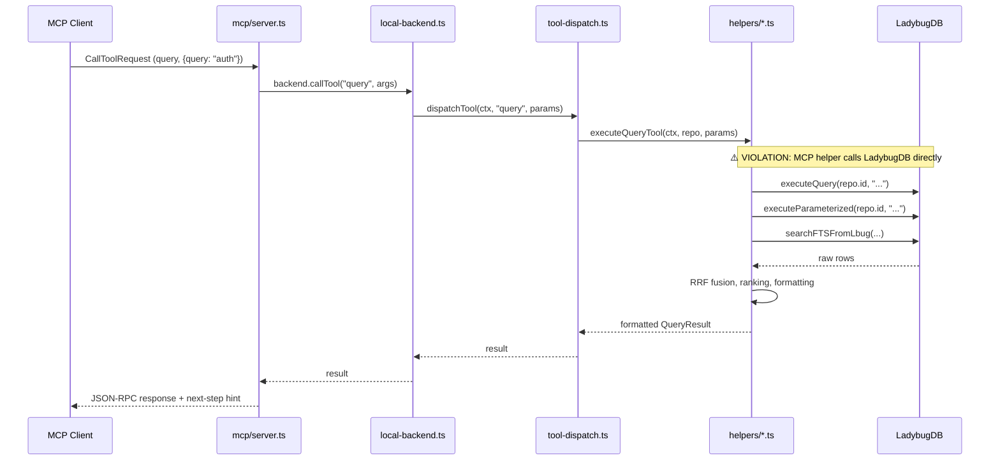
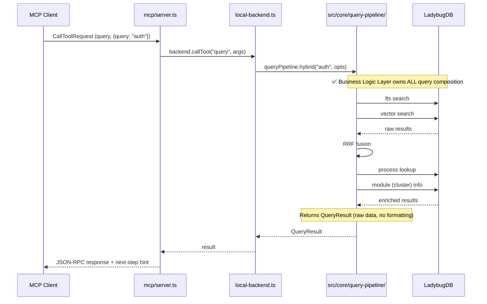

# MCP Adapter — Model Context Protocol Port

**Path:** `src/mcp/` — 7 files + `src/mcp/local/helpers/` — 14 files
**Framework:** `@modelcontextprotocol/sdk` (`^1.0.0`)
**Transport:** stdio (JSON-RPC) with stdout sentinel to protect protocol integrity
**Server Capabilities:** tools, resources, prompts

---

## 1. Architecture

```
src/mcp/
├── server.ts                          (354 lines) Transport-agnostic Server + stdio startup
├── tools.ts                           (550 lines) 16 tool definitions (GITNEXUS_TOOLS)
├── resources.ts                       Resource URIs + templates (context, clusters, processes, schema)
├── stdio-context.ts                   Global stdout sentinel (intercepts stray writes)
├── stdio-capture.ts                   Stdout write capture implementation
├── compatible-stdio-transport.ts      Safe stdout Proxy transport
├── staleness.ts                       Index staleness checks
└── local/
    ├── local-backend.ts               (127 lines) Thin orchestration layer
    └── helpers/
        ├── tool-dispatch.ts           (65 lines)  Method → helper function router
        ├── context-tools.ts           (334 lines) context, cypher, overview, explore
        ├── search.ts                  (354 lines) BM25, vector, hybrid + query tool
        ├── impact.ts                  (320 lines) BFS impact analysis
        ├── detect-changes.ts          Git diff → symbol → process mapping
        ├── rename.ts                  Multi-file rename with confidence tagging
        ├── api-tools.ts               route_map, shape_check, tool_map, api_impact
        ├── graph-queries.ts           Clusters and processes query helpers
        ├── group.ts                   Multi-repo group tool dispatch
        ├── symbol-resolution.ts       Symbol disambiguation (BM25 prefix + exact match)
        ├── state-manager.ts           Multi-repo state management (lazy init, refresh)
        ├── constants.ts               Valid labels, relation types, test file detection
        ├── types.ts                   RepoHandle, CodebaseContext types
        └── logging.ts                 Query timing and error logging helpers
```

---

## 2. Current Tool Definitions (`src/mcp/tools.ts:54-550`)

All 16 tools with annotations and input schemas:

| # | Tool | Category | Annotation | Description |
|---|------|----------|-----------|-------------|
| 1 | `list_repos` | Discovery | readOnly | List all indexed repos, stats, last commit |
| 2 | `query` | Search | readOnly (openWorld) | Concept search, execution flows via hybrid (BM25+vector), process-grouped |
| 3 | `cypher` | Query | readOnly | Raw Cypher queries against LadybugDB, returns Markdown table |
| 4 | `context` | Navigation | readOnly | 360-degree symbol view (incoming/outgoing refs, processes, metadata) |
| 5 | `impact` | Analysis | readOnly | Blast radius via BFS traversal (upstream/downstream, depth configurable) |
| 6 | `detect_changes` | Analysis | readOnly | Git diff → symbol mapping → affected processes |
| 7 | `rename` | Refactoring | destructive | Graph + text search coordinated rename |
| 8 | `route_map` | API | readOnly | Route → handler → consumer map |
| 9 | `tool_map` | API | readOnly | MCP tool definitions |
| 10 | `shape_check` | API | readOnly | Response shape vs consumer access |
| 11 | `api_impact` | API | readOnly | Pre-change API route impact report |
| 12 | `group_list` | Group | readOnly | List repo groups or return group details |
| 13 | `group_sync` | Group | destructive | Rebuild Contract Registry for a group |
| — | `search` (legacy) | Search | — | Alias for `query` (tool-dispatch.ts:48) |
| — | `explore` (legacy) | Navigation | — | Alias for `context` (tool-dispatch.ts:50) |
| — | `overview` (legacy) | Navigation | — | Codebase overview via `executeOverview` |

---

## 3. Current Dispatch Flow (with Architecture Violation)

```
MCP Client (Claude Desktop / Cursor / Codex)
  │  stdio JSON-RPC
  ▼
src/mcp/server.ts :: CallToolRequestSchema handler           ← schema validation
  │  line 169: backend.callTool(name, args)
  ▼
src/mcp/local/local-backend.ts :: callTool(method, params)   ← thin orchestration
  │  line 52: dispatchTool(this.ctx, method, params)
  ▼
src/mcp/local/helpers/tool-dispatch.ts :: dispatchTool()     ← method routing
  │  switch(method) → calls one of 14 helper functions
  ▼
src/mcp/local/helpers/{search,context-tools,impact,...}.ts   ← BUSINESS LOGIC VIOLATION
  │  Direct imports from src/core/lbug/pool-adapter.ts:
  │    executeQuery(repo.id, cypher)
  │    executeParameterized(repo.id, cypher, params)
  │    isLbugReady(repo.id)
  │  Direct imports from src/core/embeddings/embedding-pipeline.ts:
  │    semanticSearch(executeQuery, query, limit)
  │  Direct imports from src/core/search/bm25-index.ts:
  │    searchFTSFromLbug(query, limit, repo.id)
  ▼
@ladybugdb/core — embedded graph DB
```

### Evidence of the Violation

Every helper file imports directly from `src/core/lbug/pool-adapter.ts`, bypassing any business logic abstraction:

| Helper File | Direct Imports from Core |
|-------------|-------------------------|
| `context-tools.ts:1-3` | `executeQuery`, `executeParameterized`, `isWriteQuery`, `isLbugReady` from `pool-adapter.js` |
| `search.ts:1-13` | `executeQuery`, `executeParameterized` from `pool-adapter.js`; `collectBestChunks` from `embeddings/types.js`; `rankExactEmbeddingRows` from `embeddings/exact-search.js`; `EMBEDDING_TABLE_NAME` from `lbug/schema.js` |
| `impact.ts:1-3` | `executeQuery`, `executeParameterized` from `pool-adapter.js` |
| `graph-queries.ts` | `executeQuery`, `executeParameterized` from `pool-adapter.js` |
| `detect-changes.ts` | `executeParameterized` from `pool-adapter.js` |
| `rename.ts` | `executeParameterized` from `pool-adapter.js` |
| `api-tools.ts` | `executeParameterized` from `pool-adapter.js` |

### Note: Direct imports from `src/core/embeddings/` and `src/core/search/`

While `search.ts` calls into `embedding-pipeline.ts` and `bm25-index.ts` (which are core modules, not storage-layer leaks), the issue remains that MCP **orchestrates query composition logic** — it decides how to merge BM25 + vector results, how to rank processes, and how to format the output. This orchestration belongs in the Query Pipeline, not in an MCP helper.

---

## 4. Target Architecture: MCP → Query Pipeline

```
MCP Client
  │
  ▼
src/mcp/server.ts :: CallToolRequestSchema handler
  ▼
src/mcp/local/local-backend.ts :: callTool(method, params)
  ▼
src/core/query-pipeline/index.ts :: QueryPipeline          ← NEW unified interface
  │  cypher(query) → rows
  │  fts(query, opts) → FTSResult[]
  │  vector(query, k, maxDistance) → VectorSearchResult[]
  │  hybrid(query, opts) → HybridResult[]   ← RRF fusion lives HERE
  │  rag(query, context) → RAGResponse
  │  impact(symbol, direction) → ImpactResult
  │  context(name, opts) → ContextResult
  │  overview() → CodebaseOverview
  │  explore(target, type) → ExploreResult
  ▼
src/core/lbug/pool-adapter.ts          ← ONLY QueryPipeline accesses LadybugDB
  ▼
@ladybugdb/core
```

### What Moves Where

| Helper Function | Current Location | Target Location | Interface Method |
|----------------|-----------------|----------------|-----------------|
| `executeQueryTool` | `helpers/search.ts` | `src/core/query-pipeline/search.ts` | `queryPipeline.hybrid()` |
| `executeContext` | `helpers/context-tools.ts` | `src/core/query-pipeline/context.ts` | `queryPipeline.context()` |
| `executeImpact` | `helpers/impact.ts` | `src/core/query-pipeline/impact.ts` | `queryPipeline.impact()` |
| `executeCypher` | `helpers/context-tools.ts` | `src/core/query-pipeline/cypher.ts` | `queryPipeline.cypher()` |
| `executeOverview` | `helpers/context-tools.ts` | `src/core/query-pipeline/overview.ts` | `queryPipeline.overview()` |
| `executeExplore` | `helpers/context-tools.ts` | `src/core/query-pipeline/explore.ts` | `queryPipeline.explore()` |
| `bm25Search` | `helpers/search.ts` | `src/core/query-pipeline/fts.ts` | Internal |
| `semanticSearch` | `helpers/search.ts` | `src/core/query-pipeline/vector.ts` | Internal |
| `executeDetectChanges` | `helpers/detect-changes.ts` | `src/core/query-pipeline/detect-changes.ts` | `queryPipeline.detectChanges()` |
| `executeRename` | `helpers/rename.ts` | `src/core/query-pipeline/rename.ts` | `queryPipeline.rename()` |
| `formatCypherAsMarkdown` | `helpers/context-tools.ts` | Keep in MCP | Presentation formatting stays |
| `aggregateClusters` | `helpers/symbol-resolution.ts` | Keep in MCP or move with cluster logic | — |
| `resolveSymbolCandidates` | `helpers/symbol-resolution.ts` | `src/core/query-pipeline/resolution.ts` | Internal helper |
| `executeRouteMap` | `helpers/api-tools.ts` | Keep in MCP | API-specific, not query |
| `executeShapeCheck` | `helpers/api-tools.ts` | Keep in MCP | API-specific, not query |
| `executeToolMap` | `helpers/api-tools.ts` | Keep in MCP | API-specific, not query |
| `executeApiImpact` | `helpers/api-tools.ts` | Keep in MCP | API-specific, not query |

### Helpers That Stay in MCP

These helpers contain presentation-layer concerns (API metadata, graph structure visualization, formatting):

1. **`api-tools.ts`** — route_map, shape_check, tool_map, api_impact are API-consumer metadata, not business logic
2. **`constants.ts`** — `VALID_NODE_LABELS`, `VALID_RELATION_TYPES`, `IMPACT_RELATION_CONFIDENCE`, `isTestFilePath` — shared constants
3. **`types.ts`** — `RepoHandle`, `CodebaseContext` — MCP-specific types
4. **`logging.ts`** — `logQueryError`, `logQueryTiming` — presentation-layer logging
5. **`state-manager.ts`** — Multi-repo state management (repo discovery, lazy init) — MCP-specific orchestration
6. **`group.ts`** — Group dispatch (MCP-specific routing, not business logic)
7. **`graph-queries.ts`** — Cluster/process queries (thin wrappers that call the QueryPipeline)

---

## 5. Current vs Target Mermaid Sequence

### Current (Violation)


### Target (Clean)


---

## 6. stdout Safety Design

The MCP stdio protocol requires **only JSON-RPC messages** on stdout. Stray log output corrupts the protocol. The defense is layered:

1. **`stdio-context.ts`** — `installGlobalStdoutSentinel()` intercepts `process.stdout.write`, redirects non-MCP writes to stderr
2. **`compatible-stdio-transport.ts`** — `_safeStdout` Proxy tags transport writes with `withMcpWrite()` marker
3. **`cli/mcp.ts`** — ESM evaluation-order guarantee: sentinel installed before any heavy module loads (line 37, before any `await import(...)`)

---

## 7. Cross-References

| Doc | Path | Relevance |
|-----|------|-----------|
| Presentation Layer | `01-LAYERS/01-Presentation-Layer.md:86-147` | MCP layer overview, tools table |
| Query Pipeline (Target) | `02-PIPELINES/03-Query-Pipeline.md` | Proposed QueryPipeline interface that replaces direct LadybugDB calls |
| CLI Adapter | `03-PORTS/01-CLI-Adapter.md` | CLI tool command also dispatches through LocalBackend |
| Business Logic Layer | `01-LAYERS/02-Business-Logic-Layer.md` | PipelineContract, target locations for extracted MCP helpers |
