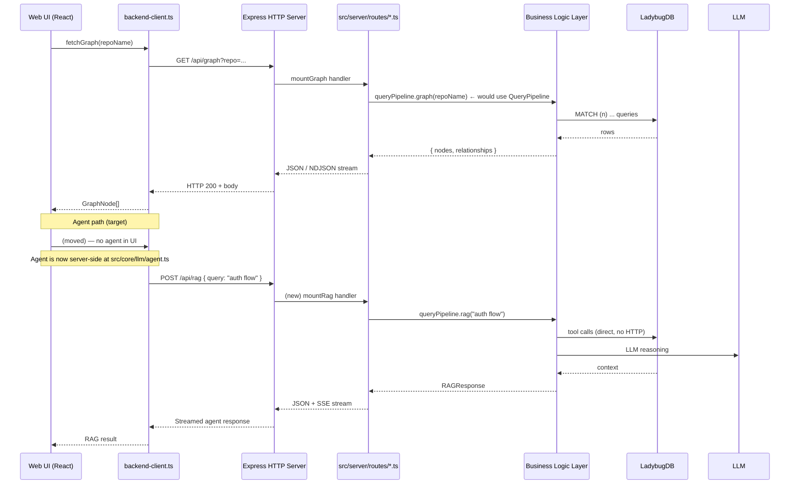

# Web UI Adapter — HTTP Client Port

**Path:** `ui/` — React/Vite SPA
**Framework:** React `^19.2.5`, Vite `^8.0.10`, Tailwind CSS `^4.2.4`
**Communication:** Pure HTTP client via `ui/src/services/backend-client.ts` (895 lines)
**Backend:** Express HTTP server at `src/server/` (port 4747, launched by `gitnexus serve`)

---

## 1. Architecture

```
ui/src/
├── services/
│   └── backend-client.ts          (895 lines) Pure HTTP client — ALL API calls
├── core/                          ⚠️ Contains business logic violations
│   ├── llm/                       🔴 MUST MOVE to src/core/llm/
│   │   ├── agent.ts               (574 lines) LangChain Graph RAG Agent
│   │   ├── tools.ts               Tool implementations (search, cypher, grep, read, overview, explore, impact)
│   │   ├── types.ts               Provider config types
│   │   ├── context-builder.ts     Dynamic system prompt builder
│   │   ├── settings-service.ts    LLM provider settings
│   │   └── index.ts               Barrel exports
│   ├── ingestion/
│   │   └── cluster-enricher.ts    (243 lines) 🔴 MUST MOVE to src/core/boost/cluster-enricher.ts
│   └── graph/
│       ├── graph.ts               Graph data structures for Sigma.js (🟡 partially valid)
│       └── types.ts               Re-exports from gitnexus-shared (🟢 clean)
├── components/                    🟢 Clean presentation components
│   ├── Graph/                     Sigma.js graph visualization
│   ├── Search/                    Search UI + results
│   ├── FileViewer/                File content viewer
│   ├── ProcessView/               Process/flow visualization
│   ├── ClusterView/               Community/cluster panels
│   ├── AnalyzeView/               Analyze trigger + progress
│   ├── Settings/                  Server URL + LLM settings
│   └── Layout/                    App shell, navigation
└── App.tsx                        (🟢 Clean) Root component
```

---

## 2. Service Layer — `backend-client.ts`

### Architecture (Correct)

The service layer at `ui/src/services/backend-client.ts:1-895` is pure HTTP — axios/fetch calls to `http://localhost:4747/api/*`. Zero pipeline code, zero LadybugDB access, zero analysis logic.

### All Endpoints

| Method | Endpoint | Lines | Purpose | Backend Route |
|--------|----------|-------|---------|---------------|
| GET | `/api/info` | 419-423 | Server version, launch context | `src/server/routes/repos.ts` |
| GET | `/api/heartbeat` (SSE) | 435-480 | Server health + auto-reconnect | `src/server/routes/health.ts` |
| GET | `/api/repos` | 504-508 | List indexed repos | `src/server/routes/repos.ts` |
| GET | `/api/repo` | 519-529 | Single repo metadata (supports `?awaitAnalysis`) | `src/server/routes/repos.ts` |
| DELETE | `/api/repo` | 483-491 | Delete repo index | `src/server/routes/repos.ts` |
| GET | `/api/graph` | 532-639 | Full graph (NDJSON stream or JSON, `?includeContent`, `?stream`) | `src/server/routes/graph.ts` |
| POST | `/api/query` | 642-654 | Execute Cypher query | `src/server/routes/query.ts` |
| POST | `/api/search` | 657-675 | Hybrid/BM25/semantic search | `src/server/routes/search.ts` |
| GET | `/api/grep` | 678-694 | Regex file search | `src/server/routes/search.ts` |
| GET | `/api/file` | 705-720 | Read file content (supports line range) | `src/server/routes/file.ts` |
| GET | `/api/processes` | 723-729 | List all processes | `src/server/routes/processes.ts` |
| GET | `/api/process` | 732-738 | Single process detail | `src/server/routes/processes.ts` |
| GET | `/api/clusters` | 741-747 | List all communities | `src/server/routes/processes.ts` |
| GET | `/api/cluster` | 750-756 | Single cluster detail | `src/server/routes/processes.ts` |
| POST | `/api/analyze` | 761-778 | Start server-side analysis | `src/server/routes/analyze.ts` |
| GET | `/api/analyze/:jobId` | 781-787 | Poll analysis status | `src/server/routes/analyze.ts` |
| DELETE | `/api/analyze/:jobId` | 790-796 | Cancel analysis | `src/server/routes/analyze.ts` |
| SSE | `/api/analyze/:jobId/progress` | 799-813 | Stream analysis progress | `src/server/routes/analyze.ts` |
| POST | `/api/embed` | 818-830 | Start server-side embeddings | `src/server/routes/embedding.ts` |
| GET | `/api/embed/:jobId` | 833-837 | Poll embedding status | `src/server/routes/embedding.ts` |
| DELETE | `/api/embed/:jobId` | 840-845 | Cancel embeddings | `src/server/routes/embedding.ts` |
| SSE | `/api/embed/:jobId/progress` | 848-859 | Stream embedding progress | `src/server/routes/embedding.ts` |

### Resiliency Features (Correct)

- Circuit breaker via `resilientFetch` (`gitnexus-shared`) — keyed by backend origin
- Method-aware retry budget: idempotent (GET) retries once, mutations (POST) single-attempt
- SSE with auto-reconnect (3 retries, exponential backoff)
- URL validation (`validateBackendUrl`) — only `http://`/`https://` allowed
- Timeout handling (30s default, 2s probe, 120s graph, 300s hold-queue)

---

## 3. Express HTTP Server Boundary (`src/server/`)

### Route Modules (9 total)

```
src/server/
├── api.ts                    (62 lines)  Express app creation, dependency injection
├── routes/
│   ├── index.ts              (23 lines)  Mounts all 9 route modules
│   ├── health.ts             GET /api/health, SSE /api/heartbeat
│   ├── repos.ts              GET /api/repos, GET /api/repo, DELETE /api/repo
│   ├── graph.ts              (175 lines) GET /api/graph (NDJSON stream + JSON)
│   ├── query.ts              (36 lines)  POST /api/query (Cypher execution)
│   ├── search.ts             (162 lines) POST /api/search (hybrid/BM25/semantic)
│   ├── file.ts               GET /api/file, GET /api/grep
│   ├── processes.ts          GET /api/processes, /api/process, /api/clusters, /api/cluster
│   ├── analyze.ts            (253 lines) POST /api/analyze (fork worker, SST-stream progress)
│   └── embedding.ts          POST /api/embed + progress streaming
├── middleware/
│   ├── index.ts              CORS, JSON parsing, rate limiting, error handler
│   ├── cors.ts               CORS origin validation
│   ├── error-handler.ts      Global error handler
│   └── repo-resolver.ts      Repository resolution + hold queue + locking
├── streaming.ts              NDJSON graph streaming, SSE progress mount
├── web-ui.ts                 Static file serving for production build
├── mcp-http.ts               MCP endpoints over HTTP (for Web UI)
├── validate.ts               Route input validation, rate limiting
├── config.ts                 DEFAULT_SERVER_CONFIG
├── types.ts                  ServerDependencies interface
├── shutdown.ts               Graceful shutdown handler
├── analyze-job.ts            JobManager for async jobs
└── git-clone.ts              Git clone/pull for remote URLs
```

### Route → Business Logic Delegation

| Route | Line | Delegates To | Pattern |
|-------|------|-------------|---------|
| `graph.ts:107` | `withLbugDb(lbugPath, buildGraph)` | `src/core/lbug/lbug-adapter.ts` | Calls LadybugDB directly (no QueryPipeline) |
| `query.ts:11` | `withLbugDb(lbugPath, executeQuery)` | `src/core/lbug/lbug-adapter.ts` | Calls LadybugDB directly (no QueryPipeline) |
| `search.ts:13` | `hybridSearch(query, limit, executeQuery, semSearch)` | `src/core/search/hybrid-search.ts` + `src/core/embeddings/embedding-pipeline.ts` | Orchestrates search composition IN the route |
| `analyze.ts:18` | Forks `analyze-worker.ts` → `runFullAnalysis` | `src/core/run-analyze.ts` | Correct — delegates to PipelineContract |
| `embedding.ts` | Forks embedding worker | `src/core/embeddings/` | Correct — delegates to embedding pipeline |

**Issue:** `search.ts:34-150` orchestrates search mode dispatch (hybrid/semantic/bm25), enrichment (connections, cluster, processes), and result formatting — all **inside the route handler**. This composition logic belongs in the Query Pipeline.

---

## 4. 🔴 Business Logic Violations That MUST Move

### Violation 1: `ui/src/core/llm/agent.ts` (574 lines)

**What it is:** LangChain-based Graph RAG Agent with multi-provider LLM support (OpenAI, Azure, Gemini, Anthropic, Ollama, OpenRouter, MiniMax, GLM).

**Evidence of business logic:**
- `createGraphRAGAgent()` — factory function creating a `createReactAgent` with 7 tool definitions
- `streamAgentResponse()` — async generator for streaming LLM responses with deduplication
- Tool implementations (from `tools.ts`): `search`, `cypher`, `grep`, `read`, `overview`, `explore`, `impact`
- Multi-provider LLM client creation with provider-specific config: `ChatOpenAI`, `AzureChatOpenAI`, `ChatGoogleGenerativeAI`, `ChatAnthropic`, `ChatOllama`
- Dynamic system prompt building (`context-builder.ts`) with repo info injection

**Target:** `src/core/llm/agent.ts` in Business Logic Layer.

**Files to move:**

| Current Path | Target Path | Lines | Reason |
|-------------|-------------|-------|--------|
| `ui/src/core/llm/agent.ts` | `src/core/llm/agent.ts` | 574 | LangGraph agent — pure business logic |
| `ui/src/core/llm/tools.ts` | `src/core/llm/tools.ts` | — | Tool implementations — should call LadybugDB directly, not HTTP |
| `ui/src/core/llm/types.ts` | `src/core/llm/types.ts` | — | Shared types |
| `ui/src/core/llm/context-builder.ts` | `src/core/llm/context-builder.ts` | — | System prompt builder |
| `ui/src/core/llm/settings-service.ts` | `src/core/llm/settings-service.ts` | — | Provider settings management |
| `ui/src/core/llm/index.ts` | `src/core/llm/index.ts` | — | Barrel exports |

**Dependency packages to move** (from `ui/package.json` to `gitnexus/package.json`):

| Package | Version |
|---------|---------|
| `@langchain/anthropic` | ^1.3.29 |
| `@langchain/core` | ^1.1.44 |
| `@langchain/google-genai` | ^2.1.28 |
| `@langchain/langgraph` | ^1.2.9 |
| `@langchain/ollama` | ^1.2.6 |
| `@langchain/openai` | ^1.4.5 |
| `langchain` | ^1.3.5 |

### Violation 2: `ui/src/core/ingestion/cluster-enricher.ts` (243 lines)

**What it is:** LLM-based semantic enrichment of Leiden communities — generates heuristic labels, keywords, and descriptions. Despite being in `ui/src/core/ingestion/`, it does NOT parse code or build graphs.

**Target:** `src/core/boost/cluster-enricher.ts` as a Post-Pipeline Processor in the Boost Pipeline.

**Evidence of business logic:**
- Loads community data from the knowledge graph
- Calls LLM providers (Anthropic, OpenAI, etc.) for semantic naming
- Writes enriched names back to the graph
- This is an LLM enrichment operation, not a presentation concern

### 🟡 Partially Valid: `ui/src/core/graph/`

- `graph.ts` — Client-side graph data structures for Sigma.js (valid)
- `types.ts` — Re-exports from `gitnexus-shared` (valid)

The graph layout calculations (`graphology-layout-force`, `-forceatlas2`, `-noverlap`) currently run **in the browser on every page load**. These should be Post-Pipeline Processors that pre-compute layouts during indexing and cache them.

---

## 5. Dependency Cleanup Plan

### Current UI Dependencies (Verified from `ui/package.json`)

| Package | After Fix | Notes |
|---------|-----------|-------|
| `react` ^19.2.5 | ✅ Keep | Core framework |
| `react-dom` ^19.2.6 | ✅ Keep | DOM renderer |
| `sigma` ^3.0.2 | ✅ Keep | Graph visualization |
| `@sigma/edge-curve` ^3.1.0 | ✅ Keep | Edge curves |
| `d3` ^7.9.0 | ✅ Keep | Charts/stats |
| `mermaid` ^11.14.0 | ✅ Keep | Diagrams |
| `lucide-react` ^1.14.0 | ✅ Keep | Icons |
| `react-markdown` + `remark-gfm` | ✅ Keep | Markdown rendering |
| `react-syntax-highlighter` | ✅ Keep | Code highlighting |
| `react-zoom-pan-pinch` | ✅ Keep | Zoom/pan for graphs |
| `tailwindcss` ^4.2.4 | ✅ Keep | CSS framework |
| `@tailwindcss/vite` ^4.2.4 | ✅ Keep | Vite plugin |
| `vite` ^8.0.10 | ✅ Keep | Build tool |
| `@vitejs/plugin-react` | ✅ Keep | React plugin |
| `axios` ^1.16.0 | ✅ Keep | HTTP client |
| `zod` ^3.25.76 | ✅ Keep | Schema validation |
| `dompurify` | ✅ Keep | XSS prevention |
| `@types/*` | ✅ Keep | TypeScript types |
| `@langchain/*` + `langchain` | 🔴 **REMOVE** | Move to Root |
| `graphology-layout-force` | 🟡 Consider | Move to Post-Pipeline Processor |
| `graphology-layout-forceatlas2` | 🟡 Consider | Move to Post-Pipeline Processor |
| `graphology-layout-noverlap` | 🟡 Consider | Move to Post-Pipeline Processor |
| `tree-sitter-wasms` | 🔴 **REMOVE** | Dead dependency (zero imports) |

---

## 6. Target Communication Flow



---

## 7. Current vs Target Architecture

### Current

```
Web UI (React)
  ├── components/ (🟢 clean)
  ├── services/backend-client.ts (🟢 clean — HTTP only)
  └── core/
      ├── llm/agent.ts (🔴 LangChain agent)
      ├── ingestion/cluster-enricher.ts (🔴 LLM enrichment)
      └── graph/ (🟡 layout calcs in browser)

                ▼ HTTP REST (axios)
Express HTTP Server (src/server/)
  └── routes/ (🟡 orchestrate search composition in routes)

                ▼ direct calls
LadybugDB (no QueryPipeline abstraction)
```

### Target

```
Web UI (React)
  ├── components/ (🟢 clean)
  └── services/backend-client.ts (🟢 clean — HTTP only)
  ✓ NO core/llm/ — agent moved to src/core/llm/
  ✓ NO core/ingestion/ — enricher moved to src/core/boost/
  ✓ graph layout calcs moved to Post-Pipeline Processors
  ✓ tree-sitter-wasms removed

                ▼ HTTP REST (axios)
Express HTTP Server (src/server/)
  └── routes/ (🟢 thin — parse HTTP, call QueryPipeline, serialize)

                ▼ QueryPipeline interface
Business Logic Layer (src/core/)
  ├── query-pipeline/ — unified read API
  │   ├── search.ts (hybrid search)
  │   ├── context.ts (symbol context)
  │   ├── impact.ts (blast radius)
  │   ├── cypher.ts (raw queries)
  │   ├── rag.ts (graph RAG agent, moved from UI)
  │   └── ...
  ├── boost/cluster-enricher.ts (moved from UI)
  └── llm/agent.ts (moved from UI)

                ▼
LadybugDB (only accessed through Business Logic Layer)
```

---

## 8. What the Web UI Does Correctly

- **`backend-client.ts:1-895`** — Pure HTTP client. No pipeline code, no direct DB access, no analysis logic.
- **Sigma.js graph visualization** (`ui/src/components/Graph/`) — Pure presentation. Renders nodes/edges downloaded via `fetchGraph()`.
- **D3 charts** — Static data visualization of stats.
- **Mermaid diagram rendering** — Client-side diagram rendering.
- **Search UI** — Search bar, results display, enrichment rendering.
- **File viewer** — Syntax-highlighted code display.
- **Analysis progress** — SSE stream + progress bar for server-side analysis.
- **Type-only imports** from `gitnexus-shared` — 16 verified import sites for types only (`GraphNode`, `GraphRelationship`, `NodeLabel`, `PipelineProgress`, etc.).

---

## 9. Cross-References

| Doc | Path | Relevance |
|-----|------|-----------|
| Presentation Layer | `01-LAYERS/01-Presentation-Layer.md:181-258` | Web UI overview, violations documented |
| Query Pipeline (Target) | `02-PIPELINES/03-Query-Pipeline.md` | Agent tool backends, read path data flow, target architecture |
| Business Logic Layer | `01-LAYERS/02-Business-Logic-Layer.md` | Target locations for agent + enricher |
| Unified Consolidated Report | `.temp_Orchestrator_HandOffs/analysis-00-unified-consolidated-report.md` | Dependency matrix, dead deps, critical findings |
