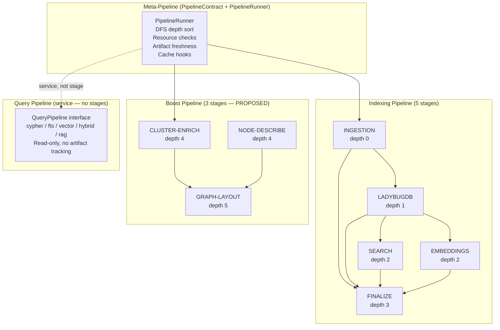

# ADR-002: PipelineContract as Meta-Pipeline over Specialized Sub-Pipelines

**Status:** Accepted
**Date:** 2026-05-15
**Deciders:** Architecture Team (Agents 1–4)
**Tags:** pipeline, dag, orchestration, indexing, boost, query

---

## Context

The GitNexus indexing system involves multiple distinct processing modes:

1. **Indexing** — Parse source code, build knowledge graph, create FTS indexes, generate embeddings. This is a write-heavy, deterministic, CPU-only pipeline that must run to completion for a repo to be queryable.
2. **Boost (LLM Enrichment)** — After indexing completes, optionally enrich the graph with LLM-generated semantic names, descriptions, and visual layouts. This is an LLM-dependent, network-accessible, optional pipeline.
3. **Query** — Read-only access to the indexed graph: Cypher queries, BM25 search, vector search, hybrid search (RRF fusion), and Graph RAG agent queries.

Before this ADR, these three modes were designed separately:
- Indexing had the `PipelineContract` DAG with 5 stages (concrete, implemented)
- Boost existed only in UI code (`ui/src/core/ingestion/cluster-enricher.ts`) with no pipeline integration
- Query was fragmented across direct LadybugDB calls in CLI, MCP helpers, Express routes, and the UI agent

We considered three architectural approaches:

### Option A: Monolithic Pipeline (Rejected)
One massive pipeline with all 8+ stages (5 indexing + 3 boost). All stages share the same runner, same artifact tracking, same caching. The Query Pipeline doesn't exist as a pipeline — it's just direct database calls.

**Pros:** Simplest design, single runner.
**Cons:** Boost stages would run on every `analyze` (wasteful LLM calls). Query pipeline isn't a write pipeline but would need to be modeled as one for consistency. No clear separation of concerns.

### Option B: Separate Independent Pipelines (Rejected)
Three completely separate pipeline systems, each with its own runner, interfaces, and artifact tracking. No shared contracts.

**Pros:** Maximum independence.
**Cons:** Duplicated runner logic. No cross-pipeline dependency management (boost depends on indexing artifacts). The `PipelineContract` interface is proven — no need to reinvent.

### Option C: PipelineContract as Meta-Pipeline (Selected)
One `PipelineContract` interface + `PipelineRunner` as the Meta-Pipeline engine. Three specialized sub-pipelines (Indexing, Boost, Query) register their stages on the same runner. Each sub-pipeline has its own contracts, resources, and artifact fingerprints. The Meta-Pipeline manages cross-pipeline dependencies and caching.

## Decision

Adopt **Option C**: `PipelineContract<T>` + `PipelineRunner` = Meta-Pipeline, with 3 specialized sub-pipelines.

### Architecture

### Sub-Pipeline Definitions

#### 1. Indexing Pipeline (Implemented)

| Stage ID | Label | Dependencies | Artifact | Resources | Status |
|----------|-------|-------------|----------|-----------|--------|
| `ingestion` | INGESTION | — | git commit hash | wasm-runtime (fatal), source-files (fatal) | Done |
| `ladybugdb` | LADYBUGDB | ingestion | timestamp (conservative) | ladybugdb-core (fatal), disk-space (fatal) | Done |
| `search` | SEARCH | ladybugdb | timestamp (conservative) | ladybugdb-core (fatal) | Done |
| `embeddings` | EMBEDDINGS | ladybugdb | timestamp (conservative) | embedding-model (fatal), onnx-runtime (fatal), memory (fatal), model-cap (degrade) | Done |
| `finalize` | FINALIZE | ingestion, ladybugdb, search, embeddings | — | filesystem (fatal) | Done |

**Progress scaling:** INGESTION 0-60% → LADYBUGDB 60-84% → SEARCH 84-90% → EMBEDDINGS 90-98% → FINALIZE 98-100%

#### 2. Boost Pipeline (Proposed — from UI code)

| Stage ID | Label | Dependencies | Artifact | Resources | Status |
|----------|-------|-------------|----------|-----------|--------|
| `cluster-enrich` | CLUSTER-ENRICH | embeddings, finalize | embeddings fingerprint composite | llm-api-key (fatal), network-access (fatal), tokens (degrade) | Target |
| `node-describe` | NODE-DESCRIBE | embeddings, finalize | embeddings fingerprint composite | llm-api-key (fatal), network-access (fatal) | Target |
| `graph-layout` | GRAPH-LAYOUT | cluster-enrich, node-describe | cluster + description fingerprints composite | memory (degrade) | Target |

**Execution mode:** Opt-in via `gitnexus analyze --boost` or `gitnexus boost`. Fail-graceful (`failFast: false`). Artifact fingerprint depends on indexing pipeline's fingerprint.

#### 3. Query Pipeline (Proposed — unifying fragmented queries)

The Query Pipeline is **not a PipelineContract stage** — it is a read-only service consumed by all presentation layers. It does not produce artifacts, does not use freshness checks, and has no `onBeforeInvalidation` hooks.

| Method | Purpose | Backend |
|--------|---------|--------|
| `cypher(query, params)` | Raw Cypher graph queries | LadybugDB `executeQuery` |
| `fts(query, options)` | BM25 full-text search | LadybugDB FTS indexes |
| `vector(query, k, maxDistance)` | Vector (semantic) search | LadybugDB vector index |
| `hybrid(query, options)` | BM25 + vector with RRF fusion | Combined FTS + vector |
| `rag(query, context)` | Graph RAG agent with LLM reasoning | LangGraph agent → LadybugDB |
| `impact(symbol, direction)` | Blast radius analysis | BFS traversal |
| `explore(target, type)` | Deep dive on symbol/cluster/process | Multiple LadybugDB queries |

### How They Share the Meta-Pipeline

1. **Same runner, different contract sets.** `run-analyze.ts` registers 5 indexing contracts. A future `run-boost.ts` would register 3 boost contracts. The `PipelineRunner` is agnostic to which contracts run — it just sorts by depth and executes.

2. **Cross-pipeline dependency via artifact fingerprints.** Boost Pipeline stages declare fingerprints that include indexing artifact fingerprints (e.g., `boost-v1-${embeddings.fingerprint}-${ingestion.fingerprint}`). When the indexing pipeline produces new artifacts, boost artifacts are invalidated.

3. **Query Pipeline is outside the runner.** It doesn't register contracts. It's a service interface consumed by CLI, MCP, and Express routes. This avoids forcing read operations into a write-oriented DAG model.

## Consequences

### Positive

1. **Clear separation of concerns** — Indexing is write-heavy and deterministic. Boost is LLM-dependent and optional. Query is read-only. Each has different error handling, resource requirements, and scheduling needs.
2. **Shared infrastructure** — All three use the same `PipelineContext`, the same artifact fingerprint system, the same resource declaration pattern. No duplicated runner logic.
3. **Independent development** — Each sub-pipeline can be developed and tested independently. The Boost Pipeline doesn't block indexing improvements, and the Query Pipeline doesn't block either.
4. **Graceful degradation** — Boost Pipeline runs with `failFast: false` (LLM API failures degrade but don't crash). Indexing runs with `failFast: true` (a corrupted index is worse than no index).
5. **Incremental migration** — Existing indexing pipeline is untouched. Boost stages can be added one at a time. Query Pipeline can be introduced gradually by migrating MCP helpers one by one.

### Negative

1. **More registered contracts** — The runner currently manages 5 contracts. Adding boost adds 3 more (total 8+). The runner's current sequential execution model means more stages = longer total pipeline time.
2. **Artifact fingerprint complexity** — Cross-pipeline fingerprint dependencies (boost depends on indexing) require careful versioning. Bumping the indexing fingerprint format requires bumping boost artifacts too.
3. **Query Pipeline is a different abstraction** — It doesn't fit the `PipelineContract` model (no `run()` method returning output, no stages, no artifacts). This means it lives outside the runner, which could feel inconsistent.
4. **Risk of Query Pipeline becoming write-capable** — Because it exposes Cypher execution, a malicious or buggy query could mutate data. Must enforce read-only access.

### Risk Assessment

| Risk | Likelihood | Impact | Mitigation |
|------|-----------|--------|------------|
| Query Pipeline introduces write operations | Low | High | Validate all queries as read-only; wrap LadybugDB connection in read-only mode |
| Boost Pipeline LLM costs unexpected | Medium | Medium | Per-repo token budget; opt-in only; `criticality: 'degrade'` for tokens |
| Cross-pipeline fingerprint version drift | Medium | Medium | Single `fingerprint` version registry; all boost artifacts reference indexing versions |
| 8+ stages slow down sequential execution | Low | Medium | Add stage parallelism (same-depth concurrent execution) as performance improvement |

## File References

### PipelineContract Core

| File | Lines | Purpose |
|------|-------|---------|
| `src/core/pipeline-contract/types.ts` | 1-83 | All contract interfaces: `PipelineContract<T>`, `PipelineContext`, `PipelineRunReport`, `ArtifactRecord`, `ResourceDeclaration`, `CachePayload` |
| `src/core/pipeline-contract/runner.ts` | 1-194 | DAG scheduler: `resolvePipelines()` (DFS depth sort at lines 4-52), `runPipelines()` (execution at lines 89-193) |
| `src/core/pipeline-contract/descriptors.ts` | 1-61 | Stage IDs (lines 4-10), dependency edges (lines 12-18), resource declarations (lines 27-49), artifact definitions (lines 57-61) |
| `src/core/pipeline-contract/stages.ts` | 1-47 | Shared type definitions: `IngestionOutput`, `EmbeddingConfig`, `EmbeddingResult`, `Device`, `AnalysisMetadata` |
| `src/core/pipeline-contract/index.ts` | 14 | Barrel exports |

### Indexing Pipeline (Implemented)

| File | Lines | Purpose |
|------|-------|---------|
| `src/core/pipeline-contract/impl/ingestion-stage.ts` | 1-42 | INGESTION concrete stage |
| `src/core/pipeline-contract/impl/lbug-stage.ts` | 1-62 | LADYBUGDB concrete stage |
| `src/core/pipeline-contract/impl/search-stage.ts` | 1-41 | SEARCH concrete stage |
| `src/core/pipeline-contract/impl/embedding-stage.ts` | 1-190 | EMBEDDINGS concrete stage |
| `src/core/pipeline-contract/impl/finalize-stage.ts` | 1-82 | FINALIZE concrete stage |
| `src/core/run-analyze.ts` | 1-154 | Orchestrator: registers 5 contracts, determines skip set, calls runner |

### Boost Pipeline (Proposed)

| File | Lines | Purpose |
|------|-------|---------|
| `ui/src/core/ingestion/cluster-enricher.ts` | 1-243 | Cluster enrichment logic (to move to `src/core/boost/cluster-enricher.ts`) |
| *(Proposed)* `src/core/boost/cluster-enrich-stage.ts` | — | CLUSTER-ENRICH contract implementation |
| *(Proposed)* `src/core/boost/node-describe-stage.ts` | — | NODE-DESCRIBE contract implementation |
| *(Proposed)* `src/core/boost/graph-layout-stage.ts` | — | GRAPH-LAYOUT contract implementation |
| *(Proposed)* `src/core/boost/index.ts` | — | Boost contract factory + registration |

### Query Pipeline (Proposed)

| File | Lines | Purpose |
|------|-------|---------|
| *(Proposed)* `src/core/query-pipeline/index.ts` | — | `QueryPipeline` interface definition |
| *(Proposed)* `src/core/query-pipeline/search.ts` | — | Hybrid search with RRF fusion |
| *(Proposed)* `src/core/query-pipeline/context.ts` | — | Symbol context (moved from MCP helpers) |
| *(Proposed)* `src/core/query-pipeline/impact.ts` | — | BFS impact analysis (moved from MCP helpers) |
| *(Proposed)* `src/core/query-pipeline/rag.ts` | — | Graph RAG agent (moved from UI) |

## Cross-References

| Document | Path | Relevance |
|----------|------|-----------|
| Meta-Pipeline | `02-PIPELINES/00-Meta-Pipeline.md` | Full PipelineContract documentation |
| Indexing Pipeline | `02-PIPELINES/01-Indexing-Pipeline.md` | 5 indexing stages documented |
| Boost Pipeline | `02-PIPELINES/02-Boost-Pipeline.md` | Proposed boost stages documented |
| Query Pipeline | `02-PIPELINES/03-Query-Pipeline.md` | Proposed query interface documented |
| Business Logic Layer | `01-LAYERS/02-Business-Logic-Layer.md` | Sub-pipeline system breakdown |
| MCP Adapter | `03-PORTS/02-MCP-Adapter.md` | MCP → QueryPipeline migration plan |
